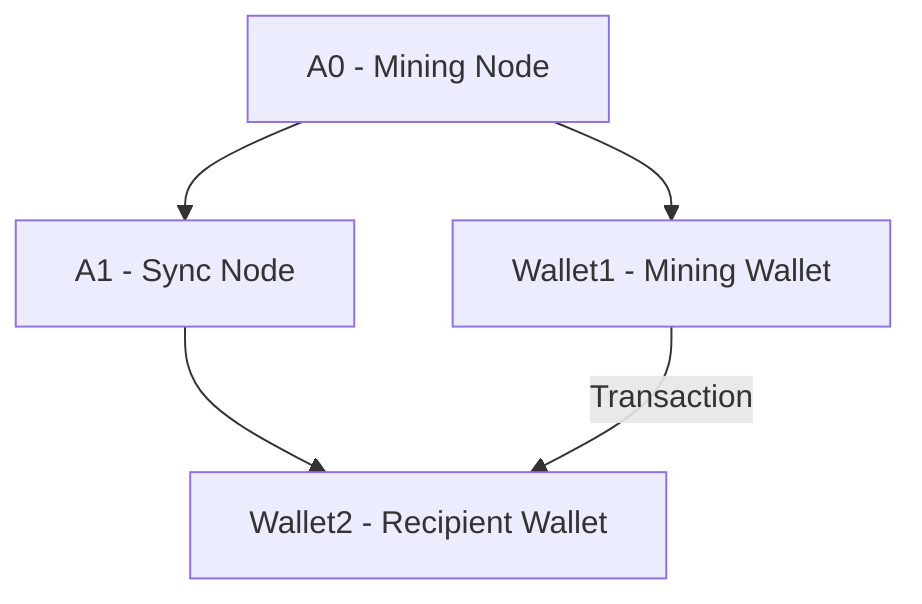

# Monerosim Architecture

## System Overview

Monerosim is a Rust-based tool that generates configuration files for the Shadow network simulator to run Monero cryptocurrency network simulations. The architecture follows a modular design with clear separation of concerns.

```
┌─────────────────────────────────────────────────────────────┐
│                     MoneroSim                              │
├─────────────────────────────────────────────────────────────┤
│  CLI Interface (main.rs)                                   │
│  ├── Configuration Parser (config.rs)                     │
│  ├── Build Manager (build.rs)                             │
│  └── Shadow Generator (shadow.rs)                         │
├─────────────────────────────────────────────────────────────┤
│  Shadow Network Simulator                                  │
│  ├── Discrete Event Engine                                │
│  ├── Virtual Network Stack                                │
│  └── Process Management                                    │
├─────────────────────────────────────────────────────────────┤
│  Modified Monero Nodes                                     │
│  ├── Shadow Compatibility Layer                           │
│  ├── P2P Networking                                       │
│  ├── Consensus Engine                                     │
│  └── Blockchain State                                     │
└─────────────────────────────────────────────────────────────┘
```

## Source Code Structure

The project is organized into several key components:

### 1. Main Application (`src/main.rs`)

- Entry point for the command-line application
- Parses command-line arguments
- Orchestrates the configuration generation process
- Coordinates the build process and shadow configuration generation

### 2. Configuration Management (`src/config.rs`)

- Defines data structures for configuration
- Parses YAML configuration files
- Validates configuration parameters
- Provides default values for optional parameters

### 3. Build Management (`src/build.rs`)

- Manages the build process for Monero binaries
- Handles cloning and patching of Monero source code
- Applies Shadow compatibility patches
- Compiles Monero with Shadow-specific flags

### 4. Shadow Configuration Generation (`src/shadow.rs`)

- Generates Shadow YAML configuration files
- Defines network topology and connections
- Configures Monero daemon processes
- Sets up wallet processes for transaction testing

## Key Components

### Configuration File (`config.yaml`)

The configuration file defines the simulation parameters:
- General settings (simulation duration, etc.)
- Node configurations (IP addresses, ports, mining status)
- Network topology settings

### Testing Scripts

Several shell scripts provide testing and monitoring capabilities:
- `simple_test.sh`: Basic mining and synchronization test
- `transaction_test.sh`: Complete workflow test including transactions
- `sync_check.sh`: Verifies network synchronization
- `block_controller.sh`: Controls block generation
- `transaction_script.sh`: Handles wallet transactions
- `monitor_script.sh`: Monitors the simulation status
- `error_handling.sh`: Provides error handling and logging utilities
- `network_config.sh`: Centralizes network configuration

## Network Architecture

The current implementation uses a simple network topology:
- Node `A0` acts as a mining node (generates blocks)
- Node `A1` synchronizes from `A0`
- Two wallet instances for transaction testing:
  - `wallet1` connected to `A0` (mining wallet)
  - `wallet2` connected to `A1` (recipient wallet)



## Data Flow

The typical workflow follows these steps:

1. User creates or modifies `config.yaml`
2. Monerosim parses the configuration
3. Monerosim builds Monero binaries with Shadow compatibility
4. Monerosim generates Shadow configuration files
5. Shadow simulator runs the simulation
6. Testing scripts verify functionality
7. Results are analyzed

## Design Decisions

### 1. Rust Implementation

Rust was chosen for its memory safety, performance, and excellent error handling, which are crucial for a system that manages complex build processes and generates critical configuration files.

### 2. YAML Configuration

YAML provides human-readable configuration with good tooling support and validation capabilities, making it easier for users to define simulation parameters.

### 3. Shadow Compatibility Layer

Rather than creating a simplified Monero model, Monerosim runs actual Monero code with minimal modifications for maximum fidelity in simulation results.

### 4. Script-Based Testing

Shell scripts provide flexible testing capabilities and can be easily modified or extended to test different aspects of the Monero network.

## File Paths

### Source Code
- `/src/main.rs`: Main application entry point
- `/src/config.rs`: Configuration management
- `/src/build.rs`: Build process management
- `/src/shadow.rs`: Shadow configuration generation

### Scripts
- `/block_controller.sh`: Controls block generation
- `/transaction_test.sh`: Tests transaction functionality
- `/sync_check.sh`: Verifies node synchronization
- `/simple_test.sh`: Basic functionality test
- `/transaction_script.sh`: Handles wallet transactions
- `/monitor_script.sh`: Monitors simulation status
- `/error_handling.sh`: Error handling utilities
- `/network_config.sh`: Network configuration

### Configuration
- `/config.yaml`: Main configuration file
- `/shadow_output/shadow.yaml`: Generated Shadow configuration