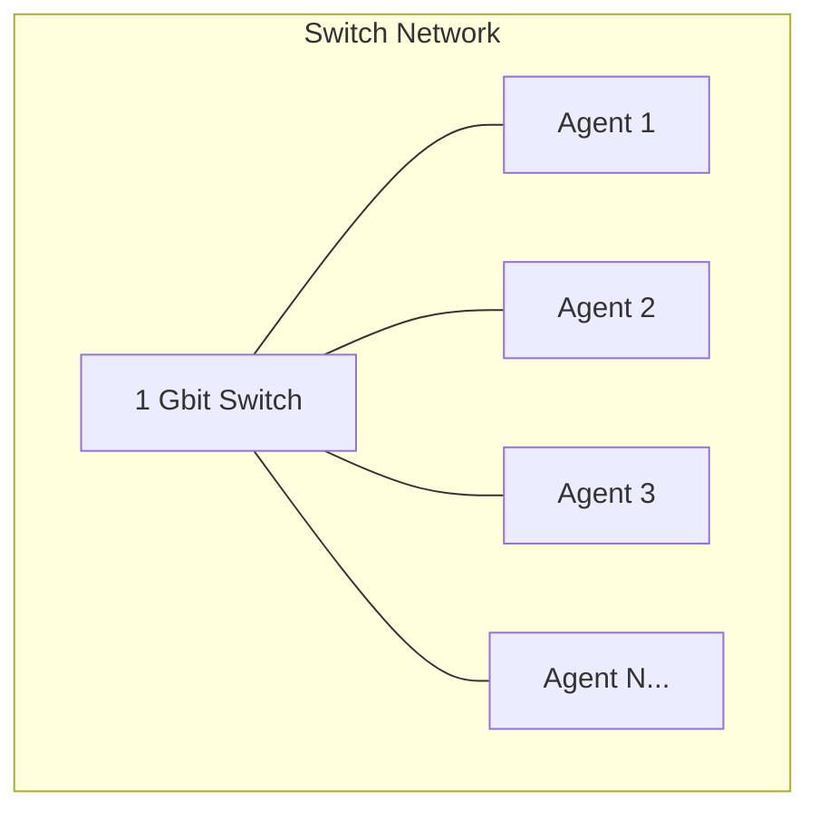
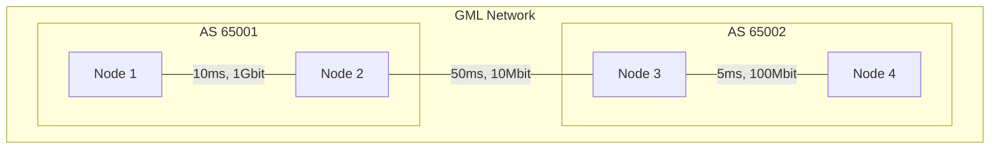
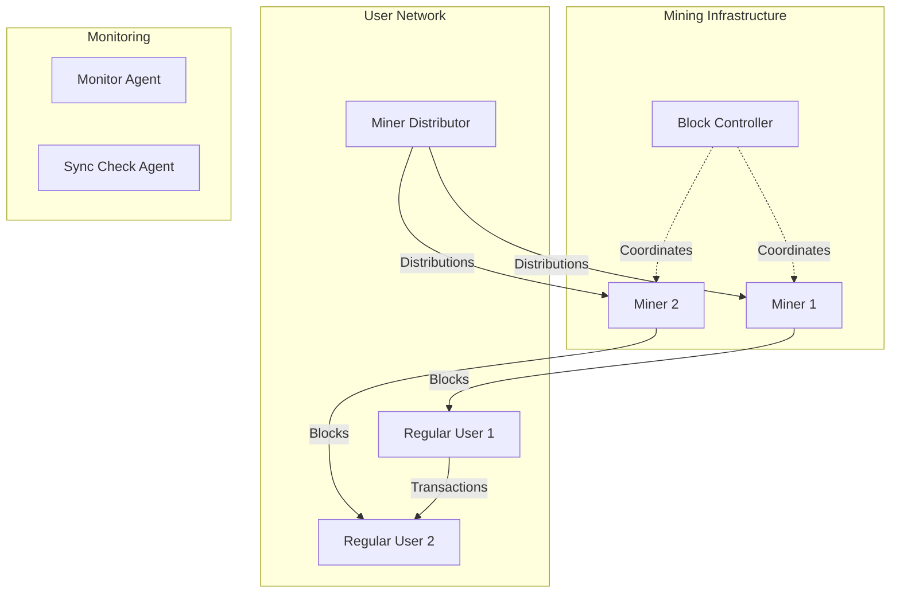

# Monerosim Architecture

## System Overview

Monerosim is a Rust-based tool that generates configuration files for the Shadow network simulator to run Monero cryptocurrency network simulations. The architecture follows a modular design with clear separation of concerns and now includes an advanced agent-based simulation framework with dual network topology support.

```
┌─────────────────────────────────────────────────────────────┐
│                     MoneroSim                              │
├─────────────────────────────────────────────────────────────┤
│  CLI Interface (main.rs)                                   │
│  ├── Configuration Parser (config_v2.rs)                  │
│  ├── GML Parser (gml_parser.rs)                           │
│  └── Agent Shadow Generator (shadow_agents.rs)            │
├─────────────────────────────────────────────────────────────┤
│  Network Topology Support                                  │
│  ├── Switch-Based Networks (Simple)                       │
│  └── GML-Based Networks (Complex)                         │
├─────────────────────────────────────────────────────────────┤
│  Agent Framework (Python)                                  │
│  ├── Base Agent (base_agent.py)                          │
│  ├── Block Controller Agent (block_controller.py)        │
│  ├── Regular User Agent (regular_user.py)                │
│  ├── Miner Distributor Agent (miner_distributor.py)      │
│  └── Monero RPC Client (monero_rpc.py)                   │
├─────────────────────────────────────────────────────────────┤
│  Shadow Network Simulator                                  │
│  ├── Discrete Event Engine                                │
│  ├── Virtual Network Stack                                │
│  └── Process Management                                    │
├─────────────────────────────────────────────────────────────┤
│  Modified Monero Nodes                                     │
│  ├── Shadow Compatibility Layer                           │
│  ├── P2P Networking                                       │
│  ├── Consensus Engine                                     │
│  └── Blockchain State                                     │
└─────────────────────────────────────────────────────────────┘
```

The system now supports two distinct network topology modes:
- **Switch-Based Networks**: Simple, high-performance topologies using Shadow's built-in switch models
- **GML-Based Networks**: Complex, realistic network topologies defined using Graph Modeling Language (GML) files

## Source Code Structure

The project is organized into several key components:

### 1. Main Application (`src/main.rs`)

- Entry point for the command-line application
- Parses command-line arguments
- Orchestrates the configuration generation process
- Coordinates the build process and shadow configuration generation
- Supports agent-based simulation mode

### 2. Configuration Management (`src/config_v2.rs`)

- Defines unified data structures for agent-based configuration
- Parses YAML configuration files with dual network topology support
- Validates configuration parameters including GML file paths
- Provides default values for optional parameters
- Supports both switch-based and GML-based network configurations

### 3. Build Management (`src/build.rs`)

- Manages the build process for Monero binaries
- Handles cloning and patching of Monero source code
- Applies Shadow compatibility patches
- Compiles Monero with Shadow-specific flags

### 3. GML Parser (`src/gml_parser.rs`)

- Custom Graph Modeling Language (GML) parser implementation
- Supports nodes, edges, and attributes for complex network topologies
- Validates network topology integrity (connectivity, node references)
- Groups nodes by Autonomous System (AS) numbers for realistic distribution
- Provides backward compatibility with legacy graph structures
- Handles network attributes like bandwidth, latency, and packet loss

### 4. Shadow Configuration Generation

#### Agent-Based Mode (`src/shadow_agents.rs`)
- Generates Shadow configurations for agent-based simulations
- Creates complex network topologies from GML files or simple switch-based models
- Intelligently distributes agents across GML network nodes using AS-aware algorithms
- Configures agent processes alongside Monero nodes
- Supports scalable simulations from small to large networks
- Generates agent and miner registries for runtime coordination

#### Peer Discovery System (`src/shadow_agents.rs`)
- Implements three peer discovery modes: Dynamic, Hardcoded, and Hybrid
- Supports four network topologies: Star, Mesh, Ring, and DAG
- Generates appropriate peer connection configurations based on selected mode and topology
- Handles seed node configuration for Hardcoded and Hybrid modes
- Validates topology requirements and agent counts
- Ensures proper network connectivity for all simulation scenarios

### 5. Agent Framework (`agents/`)

The agent framework provides a sophisticated simulation environment where different types of network participants interact autonomously:

#### Base Agent (`agents/base_agent.py`)
- Abstract base class for all agent types
- Provides lifecycle management (setup, run, cleanup)
- Handles RPC connections to Monero nodes and wallets
- Implements shared state management for inter-agent communication
- Includes signal handling and graceful shutdown

#### Block Controller Agent (`agents/block_controller.py`)
- Orchestrates mining for a single miner.
- Ensures consistent block generation
- Monitors blockchain progress

#### Monero RPC Client (`agents/monero_rpc.py`)
- Provides clean Python interface to Monero RPC APIs
- Supports both daemon and wallet RPC methods
- Includes retry logic and error handling
- Used by all agents for blockchain interaction

## Key Components

### Configuration File (`config.yaml`)

The configuration file defines the simulation parameters:
- General settings (simulation duration, etc.)
- Node configurations (IP addresses, ports, mining status)
- Network topology settings

### Agent Configuration Files

New configuration files for agent-based simulations:
- `config_agents_small.yaml`: 2 users
- `config_agents_medium.yaml`: 10 users
- `config_agents_large.yaml`: 100 users

### Agent Framework (`agents/`)

The agent framework consists of autonomous scripts that run within the Shadow simulation environment, representing different types of network participants:

#### Core Agent Classes
- `agents/base_agent.py`: Abstract base class for all agents with lifecycle management
- `agents/block_controller.py`: Orchestrates mining across the network
- `agents/regular_user.py`: Simulates regular cryptocurrency users with transaction behavior
- `agents/miner_distributor.py`: Manages mining reward distribution
- `agents/monero_rpc.py`: RPC client library for Monero daemon and wallet communication
- `agents/agent_discovery.py`: Dynamic agent discovery system for peer coordination

### External Scripts (`scripts/`)

The project includes external utility scripts that run outside the Shadow environment for post-simulation analysis and processing:

#### Log Analysis and Processing Scripts
- `scripts/log_processor.py`: Intelligent log processing and analysis
- `scripts/analyze_network_connectivity.py`: Network connectivity analysis
- `scripts/analyze_success_criteria.py`: Success criteria evaluation

#### Supporting Python Modules
- `scripts/error_handling.py`: Provides error handling and logging utilities
- `scripts/network_config.py`: Centralizes network configuration

#### Legacy Bash Scripts (Deprecated - Moved to legacy_scripts/)
- `legacy_scripts/simple_test.sh`: Basic mining and synchronization test
- `legacy_scripts/sync_check.sh`: Verifies network synchronization
- `legacy_scripts/block_controller.sh`: Controls block generation
- `legacy_scripts/monitor_script.sh`: Monitors the simulation status
- `legacy_scripts/error_handling.sh`: Provides error handling and logging utilities
- `legacy_scripts/network_config.sh`: Centralizes network configuration

**Note**: Agents run within Shadow as part of the simulation, while scripts run externally for setup, monitoring, and analysis. The Python scripts are the primary implementation and have been verified in production simulations. Bash scripts are deprecated and retained only for historical reference.

## Network Architecture

Monerosim supports two distinct network topology approaches, each optimized for different simulation requirements:

### Switch-Based Network Topology

The switch-based implementation uses Shadow's built-in network models for high-performance simulations:

```yaml
network:
  type: "1_gbit_switch"
```



**Characteristics:**
- **High Performance**: Optimized for speed and resource efficiency
- **Simple Configuration**: Single network type parameter
- **Uniform Connectivity**: All nodes have identical network characteristics
- **Scalable**: Handles large numbers of agents efficiently

### GML-Based Network Topology

The GML-based implementation supports complex, realistic network topologies defined using Graph Modeling Language:

```yaml
network:
  path: "testnet.gml"
```



**Characteristics:**
- **Realistic Topology**: Models actual internet infrastructure
- **Autonomous Systems**: Supports AS-aware agent distribution
- **Variable Network Conditions**: Different bandwidth, latency, packet loss per link
- **Complex Routing**: Multi-hop paths between agents
- **Research-Grade**: Suitable for academic network studies

### Agent-Based Network Participants

Both network types support the same agent-based simulation framework:



**Key Features:**
- **Scalable**: Supports 2 to 100+ participants
- **Realistic**: Models actual cryptocurrency network behavior
- **Autonomous**: Agents make independent decisions
- **Coordinated**: Block generation is orchestrated for consistency
- **Topology-Agnostic**: Works with both switch and GML networks

## Data Flow

Monerosim supports two distinct configuration workflows depending on the chosen network topology:

### Switch-Based Workflow

1. User creates or modifies `config.yaml`, specifying a switch network type.
2. Monerosim parses the YAML configuration.
3. Monerosim generates a Shadow configuration with switch-based topology.
4. Shadow starts all processes in the switch network.
5. Agents interact through the high-performance switch.
6. Results are collected and analyzed.

### GML-Based Workflow

1. User creates or modifies `config.yaml`, specifying a GML topology file.
2. Monerosim parses the YAML configuration and validates the GML file path.
3. GML Parser loads and validates the network topology.
4. Agent distribution algorithm assigns agents to GML nodes (AS-aware).
5. Shadow Agent Generator creates configuration with embedded GML topology.
6. Shadow starts all processes in the specified network topology.
7. Agents interact autonomously across the simulated internet.
8. Results are collected and analyzed.

### Comprehensive Data Flow Diagram

```mermaid
graph TD
    subgraph "Configuration Input"
        CONFIG[config.yaml]
        GML[testnet.gml]
    end

    subgraph "MoneroSim Core"
        PARSER[Config Parser<br/>config_v2.rs]
        GMLP[GML Parser<br/>gml_parser.rs]
        GENERATOR[Shadow Agent Generator<br/>shadow_agents.rs]
    end

    subgraph "Network Topology Decision"
        SWITCH{Switch Network?}
        GMLNET{GML Network?}
    end

    subgraph "Agent Distribution"
        SIMPLE[Simple Round-Robin<br/>Distribution]
        ASAWARE[AS-Aware Intelligent<br/>Distribution]
    end

    subgraph "Output Generation"
        SHADOWCONF[shadow_agents.yaml]
        AGENTREG[agent_registry.json]
        MINERREG[miners.json]
    end

    CONFIG --> PARSER
    PARSER --> SWITCH
    PARSER --> GMLNET
    
    SWITCH -->|type: "1_gbit_switch"| SIMPLE
    GMLNET -->|path: "testnet.gml"| GML
    GML --> GMLP
    GMLP --> ASAWARE
    
    SIMPLE --> GENERATOR
    ASAWARE --> GENERATOR
    
    GENERATOR --> SHADOWCONF
    GENERATOR --> AGENTREG
    GENERATOR --> MINERREG
```

## Agent Communication Architecture

Agents communicate through a shared state mechanism:

```
/tmp/monerosim_shared/
├── block_controller.json        # Block controller status
├── transactions.json            # Transaction log
├── blocks_found.json           # Block discovery log
├── agent_registry.json         # Agent registry for discovery
├── miners.json                 # Miner registry with hashrate weights
└── [agent]_stats.json          # Per-agent statistics
```

This architecture enables:
- **Decentralized coordination**: No central control point
- **Fault tolerance**: Agents can recover from failures
- **Observability**: All actions are logged and traceable
- **Flexibility**: Easy to add new agent types

## Peer Discovery Architecture

The peer discovery system enables dynamic agent discovery and supports scaling to hundreds of agents. It replaces the legacy hardcoded network configuration approach with intelligent peer connection management.

### Peer Discovery Modes

1. **Dynamic Mode**:
   - Intelligent seed selection algorithm
   - Miners are prioritized as seed nodes
   - Automatic adaptation to network changes
   - Best for research and optimization scenarios

2. **Hardcoded Mode**:
   - Explicit peer connections based on topology templates
   - Predictable and reproducible connections
   - Manual configuration for precise control
   - Best for testing and validation

3. **Hybrid Mode**:
   - Combines structured topology with discovery elements
   - GML-based network topologies with dynamic elements
   - Robust for complex network scenarios
   - Best for production-like simulations

### Network Topologies

The system supports four fundamental network topologies:

1. **Star Topology**: Hub-and-spoke architecture with central coordination
2. **Mesh Topology**: Fully connected network for maximum redundancy
3. **Ring Topology**: Circular connections for structured communication
4. **DAG Topology**: Traditional blockchain behavior (default)

### Agent Discovery System (`agents/agent_discovery.py`)

The AgentDiscovery class provides comprehensive agent discovery capabilities:

- **Registry Management**: Loads and caches agent information from shared state
- **Type-based Filtering**: Find agents by type (miner, wallet, daemon, etc.)
- **Attribute-based Filtering**: Find agents by specific attributes
- **Distribution Recipients**: Identify agents eligible for mining distributions
- **Error Handling**: Robust error handling with detailed logging
- **Caching**: Performance optimization with configurable TTL

### Integration with Shadow Configuration

The peer discovery system integrates seamlessly with Shadow configuration generation:

- **Topology Validation**: Ensures network connectivity requirements are met
- **Peer Connection Generation**: Creates appropriate `--add-exclusive-node` arguments
- **Seed Node Management**: Handles explicit seed node configuration
- **Scalability Support**: Efficient handling of large agent counts

## GML Integration

### GML File Format Requirements

Monerosim supports a subset of the Graph Modeling Language (GML) specification optimized for network simulation:

```gml
graph [
  # Graph-level attributes (optional)
  directed 1
  
  # Network nodes
  node [ id 0 AS "65001" bandwidth "1000Mbit" ]
  node [ id 1 AS "65001" bandwidth "500Mbit" ]
  node [ id 2 AS "65002" bandwidth "100Mbit" ]
  
  # Network edges (connections)
  edge [ source 0 target 1 latency "10ms" bandwidth "1Gbit" ]
  edge [ source 1 target 2 latency "50ms" bandwidth "100Mbit" packet_loss "0.1%" ]
  edge [ source 2 target 0 latency "75ms" bandwidth "10Mbit" ]
]
```

### Supported GML Attributes

#### Node Attributes
- **`id`** (required): Unique numeric identifier for the node
- **`label`** (optional): Human-readable name for the node
- **`AS`** or **`as`** (optional): Autonomous System number for grouping
- **`bandwidth`**, **`bandwidth_up`**, **`bandwidth_down`** (optional): Node bandwidth limits
- **`packet_loss`** (optional): Node-level packet loss percentage

#### Edge Attributes
- **`source`** (required): Source node ID
- **`target`** (required): Target node ID
- **`latency`** (optional): Link latency (default: "10ms")
- **`bandwidth`** (optional): Link bandwidth (default: "1000Mbit")
- **`packet_loss`** (optional): Link packet loss percentage

### Agent Distribution Algorithm

The GML integration includes an intelligent agent distribution algorithm:

1. **Autonomous System Detection**: Groups nodes by AS numbers if available
2. **AS-Aware Distribution**: Distributes agents across different AS groups for realism
3. **Load Balancing**: Ensures even distribution within AS groups
4. **Fallback Strategy**: Uses round-robin distribution if no AS information is available

```rust
// Example distribution for 6 agents across 2 AS groups
AS 65001: [Node 0, Node 1] -> Agents [0, 2, 4]
AS 65002: [Node 2, Node 3] -> Agents [1, 3, 5]
```

### Network Topology Validation

The GML parser includes comprehensive validation:

- **Node ID Uniqueness**: Ensures no duplicate node IDs
- **Edge Validity**: Verifies all edges reference existing nodes
- **Connectivity Check**: Warns about disconnected networks
- **Attribute Validation**: Validates bandwidth and latency formats

## Design Decisions

### 1. Rust Implementation

Rust was chosen for its memory safety, performance, and excellent error handling, which are crucial for a system that manages complex build processes and generates critical configuration files.

### 2. YAML Configuration

YAML provides human-readable configuration with good tooling support and validation capabilities, making it easier for users to define simulation parameters.

### 3. Shadow Compatibility Layer

Rather than creating a simplified Monero model, Monerosim runs actual Monero code with minimal modifications for maximum fidelity in simulation results.

### 4. Script-Based Testing

Shell scripts provide flexible testing capabilities and can be easily modified or extended to test different aspects of the Monero network. Python scripts (now verified and primary) offer improved reliability and better error handling.

### 5. Agent-Based Architecture

The agent framework was added to:
- Enable realistic network behavior modeling
- Support scalable simulations
- Provide autonomous decision-making
- Facilitate complex interaction patterns
- Allow for emergent network behaviors

### 6. Python Agent Implementation

Python was chosen for agents because:
- Rapid development and iteration
- Excellent RPC library support
- Easy integration with analysis tools
- Good async/concurrent programming support
- Accessible for researchers to modify

### 7. Custom GML Parser Implementation

A custom GML parser was implemented instead of using existing libraries because:
- **Lightweight**: Minimal dependencies and fast parsing
- **Shadow-Specific**: Optimized for Shadow network simulator requirements
- **Validation**: Built-in topology validation and error reporting
- **Flexibility**: Easy to extend with new attributes and features
- **Control**: Full control over parsing behavior and error handling

### 8. Dual Network Topology Support

The decision to support both switch and GML topologies provides:
- **Performance vs. Realism Trade-off**: Switch for speed, GML for accuracy
- **Backward Compatibility**: Existing configurations continue to work
- **Research Flexibility**: Researchers can choose appropriate complexity level
- **Development Efficiency**: Simple switch networks for development and testing

### 9. Autonomous System-Aware Agent Distribution

The AS-aware distribution algorithm was implemented to:
- **Model Real Networks**: Reflects actual internet topology structure
- **Improve Realism**: Agents are distributed as they would be in reality
- **Enable Research**: Supports studies of inter-AS cryptocurrency traffic
- **Maintain Simplicity**: Falls back to simple distribution when AS info is unavailable

## File Paths

### Source Code
- `/src/main.rs`: Main application entry point
- `/src/config_v2.rs`: Unified configuration management with dual topology support
- `/src/gml_parser.rs`: Graph Modeling Language parser and validation
- `/src/shadow_agents.rs`: Agent-based Shadow configuration with GML integration
- `/src/build.rs`: Build process management (legacy)

### Agent Framework
- `/agents/agent_discovery.py`: Dynamic agent discovery system
- `/agents/base_agent.py`: Base agent class
- `/agents/block_controller.py`: Block controller implementation
- `/agents/regular_user.py`: Regular user agent implementation
- `/agents/miner_distributor.py`: Mining reward distribution agent
- `/agents/monero_rpc.py`: RPC client library


### External Scripts
- `/scripts/log_processor.py`: Intelligent log processing and analysis
- `/scripts/analyze_network_connectivity.py`: Network connectivity analysis
- `/scripts/analyze_success_criteria.py`: Success criteria evaluation
- `/scripts/error_handling.py`: Error handling utilities
- `/scripts/network_config.py`: Network configuration

### Scripts (Bash - Deprecated)
- `/legacy_scripts/block_controller.sh`: Controls block generation
- `/legacy_scripts/sync_check.sh`: Verifies node synchronization
- `/legacy_scripts/simple_test.sh`: Basic functionality test
- `/legacy_scripts/monitor_script.sh`: Monitors simulation status
- `/legacy_scripts/error_handling.sh`: Error handling utilities
- `/legacy_scripts/network_config.sh`: Network configuration

### Configuration
- `/config.yaml`: Main configuration file (switch-based network)
- `/config_agents_small.yaml`: Small agent simulation (switch-based)
- `/config_agents_medium.yaml`: Medium agent simulation (switch-based)
- `/config_agents_large.yaml`: Large agent simulation (switch-based)
- `/testnet.gml`: Example GML network topology file
- `/shadow_output/shadow_agents.yaml`: Generated agent configuration

### Generated Runtime Files
- `/tmp/monerosim_shared/agent_registry.json`: Runtime agent information
- `/tmp/monerosim_shared/miners.json`: Miner registry with hashrate weights
- `/tmp/monerosim_shared/block_controller.json`: Block controller status
- `/tmp/monerosim_shared/transactions.json`: Transaction log

## Performance Considerations

### Agent Scalability

The agent architecture has been designed for scalability:

1. **Small Scale (2-10 agents)**:
   - Minimal resource usage
   - Good for development and testing
   - Near real-time performance

2. **Medium Scale (10-50 agents)**:
   - Moderate resource usage
   - Realistic network dynamics
   - Slight simulation slowdown

3. **Large Scale (50-100+ agents)**:
   - Higher resource requirements
   - Complex emergent behaviors
   - Significant simulation slowdown

### Optimization Strategies

1. **Staggered Startup**: Agents start at different times to prevent resource contention
2. **Shared State Batching**: Agents batch state updates to reduce I/O
3. **Efficient RPC Usage**: Connection pooling and retry logic
4. **Selective Logging**: Configurable log levels per agent type

## Recent Code Quality Improvements

Following an extensive AI-assisted code review, significant improvements have been made to enhance code modularity, maintainability, and robustness:

### Rust Codebase Refactoring

The Rust components have been refactored for improved modularity:

- **Configuration Module Separation**: `config_v2.rs` now has clearer separation between parsing logic and validation logic
- **Shadow Agent Generation**: `shadow_agents.rs` has been modularized with dedicated functions for different network topology generation modes
- **GML Parser Enhancements**: `gml_parser.rs` includes improved error handling and validation with better separation of concerns
- **Main Application**: `main.rs` now has cleaner orchestration logic with better error propagation

### Python Agent Framework Refactoring

The Python agent framework has undergone significant modular improvements:

- **Wallet Registration System**: Implemented decentralized wallet registration with robust error handling and backward compatibility
- **Agent Discovery**: Enhanced `agent_discovery.py` with improved caching mechanisms and type-based filtering
- **Base Agent Class**: `base_agent.py` now includes better lifecycle management and signal handling
- **RPC Client**: `monero_rpc.py` has improved retry logic and connection pooling
- **Block Controller**: `block_controller.py` includes enhanced mining coordination with weighted selection algorithms

### Code Quality Metrics

- **Error Handling**: Robust error handling with detailed logging and recovery
- **Documentation**: Comprehensive inline documentation and API references
- **Modularity**: Clear separation of concerns with well-defined interfaces

These improvements ensure the codebase is more maintainable, testable, and scalable for future development while maintaining backward compatibility with existing configurations and simulations.
