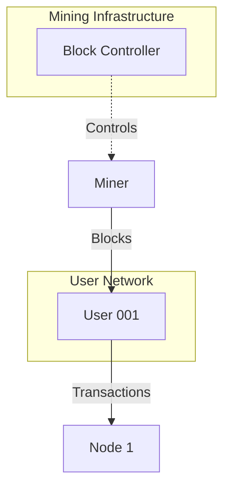

# Monerosim Architecture

## System Overview

Monerosim is a Rust-based tool that generates configuration files for the Shadow network simulator to run Monero cryptocurrency network simulations. The architecture follows a modular design with clear separation of concerns and now includes an advanced agent-based simulation framework.

```
┌─────────────────────────────────────────────────────────────┐
│                     MoneroSim                              │
├─────────────────────────────────────────────────────────────┤
│  CLI Interface (main.rs)                                   │
│  ├── Configuration Parser (config.rs)                     │
│  ├── Build Manager (build.rs)                             │
│  └── Agent Shadow Generator (shadow_agents.rs)            │
├─────────────────────────────────────────────────────────────┤
│  Agent Framework (Python)                                  │
│  ├── Base Agent (base_agent.py)                          │
│  ├── Block Controller Agent (block_controller.py)        │
│  └── Monero RPC Client (monero_rpc.py)                   │
├─────────────────────────────────────────────────────────────┤
│  Shadow Network Simulator                                  │
│  ├── Discrete Event Engine                                │
│  ├── Virtual Network Stack                                │
│  └── Process Management                                    │
├─────────────────────────────────────────────────────────────┤
│  Modified Monero Nodes                                     │
│  ├── Shadow Compatibility Layer                           │
│  ├── P2P Networking                                       │
│  ├── Consensus Engine                                     │
│  └── Blockchain State                                     │
└─────────────────────────────────────────────────────────────┘
```

## Source Code Structure

The project is organized into several key components:

### 1. Main Application (`src/main.rs`)

- Entry point for the command-line application
- Parses command-line arguments
- Orchestrates the configuration generation process
- Coordinates the build process and shadow configuration generation
- Supports agent-based simulation mode

### 2. Configuration Management (`src/config.rs`)

- Defines data structures for configuration
- Parses YAML configuration files
- Validates configuration parameters
- Provides default values for optional parameters

### 3. Build Management (`src/build.rs`)

- Manages the build process for Monero binaries
- Handles cloning and patching of Monero source code
- Applies Shadow compatibility patches
- Compiles Monero with Shadow-specific flags

### 4. Shadow Configuration Generation

#### Agent-Based Mode (`src/shadow_agents.rs`)
- Generates Shadow configurations for agent-based simulations
- Creates complex network topologies with multiple participant types
- Configures agent processes alongside Monero nodes
- Supports scalable simulations from small to large networks

### 5. Agent Framework (`agents/`)

The agent framework provides a sophisticated simulation environment where different types of network participants interact autonomously:

#### Base Agent (`agents/base_agent.py`)
- Abstract base class for all agent types
- Provides lifecycle management (setup, run, cleanup)
- Handles RPC connections to Monero nodes and wallets
- Implements shared state management for inter-agent communication
- Includes signal handling and graceful shutdown

#### Block Controller Agent (`agents/block_controller.py`)
- Orchestrates mining for a single miner.
- Ensures consistent block generation
- Monitors blockchain progress

#### Monero RPC Client (`agents/monero_rpc.py`)
- Provides clean Python interface to Monero RPC APIs
- Supports both daemon and wallet RPC methods
- Includes retry logic and error handling
- Used by all agents for blockchain interaction

## Key Components

### Configuration File (`config.yaml`)

The configuration file defines the simulation parameters:
- General settings (simulation duration, etc.)
- Node configurations (IP addresses, ports, mining status)
- Network topology settings

### Agent Configuration Files

New configuration files for agent-based simulations:
- `config_agents_small.yaml`: 2 users
- `config_agents_medium.yaml`: 10 users
- `config_agents_large.yaml`: 100 users

### Testing Scripts

The project includes comprehensive testing scripts that run within the shadow environment. A Python migration has been completed and verified to improve reliability and maintainability:

#### Python Scripts (Primary Implementation)
- `scripts/simple_test.py`: Basic mining and synchronization test
- `scripts/sync_check.py`: Verifies network synchronization
- `scripts/block_controller.py`: Controls block generation
- `scripts/monitor.py`: Monitors the simulation status
- `scripts/transaction_script.py`: Enhanced transaction handling
- `scripts/test_p2p_connectivity.py`: P2P connection verification

#### Supporting Python Modules
- `scripts/error_handling.py`: Provides error handling and logging utilities
- `scripts/network_config.py`: Centralizes network configuration

#### Legacy Bash Scripts (Deprecated - Moved to legacy_scripts/)
- `legacy_scripts/simple_test.sh`: Basic mining and synchronization test
- `legacy_scripts/sync_check.sh`: Verifies network synchronization
- `legacy_scripts/block_controller.sh`: Controls block generation
- `legacy_scripts/monitor_script.sh`: Monitors the simulation status
- `legacy_scripts/error_handling.sh`: Provides error handling and logging utilities
- `legacy_scripts/network_config.sh`: Centralizes network configuration

**Note**: The Python scripts are the primary implementation and have been verified in production simulations. Bash scripts are deprecated and retained only for historical reference.

## Network Architecture

### Traditional Network Topology

The traditional implementation uses a simple network topology:
- Node `A0` acts as a mining node (generates blocks)
- Node `A1` synchronizes from `A0`
- Two wallet instances for transaction testing:
  - `wallet1` connected to `A0` (mining wallet)
  - `wallet2` connected to `A1` (recipient wallet)


### Agent-Based Network Topology

The agent-based architecture supports complex, realistic network simulations:



Key features of the agent-based topology:
- **Scalable**: Supports 2 to 100+ participants
- **Realistic**: Models actual cryptocurrency network behavior
- **Autonomous**: Agents make independent decisions
- **Coordinated**: Block generation is orchestrated for consistency

## Data Flow

### Traditional Workflow

1. User creates or modifies `config.yaml`
2. Monerosim parses the configuration
3. Monerosim builds Monero binaries with Shadow compatibility
4. Monerosim generates Shadow configuration files
5. Shadow simulator runs the simulation
6. Testing scripts verify functionality
7. Results are analyzed

### Agent-Based Workflow

1. User selects agent configuration (small/medium/large)
2. Monerosim generates agent-aware Shadow configuration
3. Shadow starts all processes in proper sequence:
   - Monero daemons initialize first
   - Wallet RPC services start next
   - Agents activate and begin their behaviors
4. Agents interact autonomously
5. Shared state files enable agent coordination
6. Results are collected and analyzed

## Agent Communication Architecture

Agents communicate through a shared state mechanism:

```
/tmp/monerosim_shared/
├── block_controller.json        # Block controller status
├── transactions.json            # Transaction log
├── blocks_found.json           # Block discovery log
└── [agent]_stats.json          # Per-agent statistics
```

This architecture enables:
- **Decentralized coordination**: No central control point
- **Fault tolerance**: Agents can recover from failures
- **Observability**: All actions are logged and traceable
- **Flexibility**: Easy to add new agent types

## Design Decisions

### 1. Rust Implementation

Rust was chosen for its memory safety, performance, and excellent error handling, which are crucial for a system that manages complex build processes and generates critical configuration files.

### 2. YAML Configuration

YAML provides human-readable configuration with good tooling support and validation capabilities, making it easier for users to define simulation parameters.

### 3. Shadow Compatibility Layer

Rather than creating a simplified Monero model, Monerosim runs actual Monero code with minimal modifications for maximum fidelity in simulation results.

### 4. Script-Based Testing

Shell scripts provide flexible testing capabilities and can be easily modified or extended to test different aspects of the Monero network. Python scripts (now verified and primary) offer improved reliability and better error handling.

### 5. Agent-Based Architecture

The agent framework was added to:
- Enable realistic network behavior modeling
- Support scalable simulations
- Provide autonomous decision-making
- Facilitate complex interaction patterns
- Allow for emergent network behaviors

### 6. Python Agent Implementation

Python was chosen for agents because:
- Rapid development and iteration
- Excellent RPC library support
- Easy integration with analysis tools
- Good async/concurrent programming support
- Accessible for researchers to modify

## File Paths

### Source Code
- `/src/main.rs`: Main application entry point
- `/src/config.rs`: Configuration management
- `/src/build.rs`: Build process management
- `/src/shadow_agents.rs`: Agent-based Shadow configuration

### Agent Framework
- `/agents/base_agent.py`: Base agent class
- `/agents/block_controller.py`: Block controller implementation
- `/agents/monero_rpc.py`: RPC client library

### Scripts (Python - Primary Implementation)
- `/scripts/block_controller.py`: Controls block generation
- `/scripts/sync_check.py`: Verifies node synchronization
- `/scripts/simple_test.py`: Basic functionality test
- `/scripts/monitor.py`: Monitors simulation status
- `/scripts/transaction_script.py`: Transaction handling
- `/scripts/test_p2p_connectivity.py`: P2P connectivity test
- `/scripts/error_handling.py`: Error handling utilities
- `/scripts/network_config.py`: Network configuration

### Scripts (Bash - Deprecated)
- `/legacy_scripts/block_controller.sh`: Controls block generation
- `/legacy_scripts/sync_check.sh`: Verifies node synchronization
- `/legacy_scripts/simple_test.sh`: Basic functionality test
- `/legacy_scripts/monitor_script.sh`: Monitors simulation status
- `/legacy_scripts/error_handling.sh`: Error handling utilities
- `/legacy_scripts/network_config.sh`: Network configuration

### Configuration
- `/config.yaml`: Main configuration file
- `/config_agents_small.yaml`: Small agent simulation
- `/config_agents_medium.yaml`: Medium agent simulation
- `/config_agents_large.yaml`: Large agent simulation
- `/shadow_output/shadow.yaml`: Generated Shadow configuration
- `/shadow_agents_output/shadow_agents.yaml`: Generated agent configuration

## Performance Considerations

### Agent Scalability

The agent architecture has been designed for scalability:

1. **Small Scale (2-10 agents)**:
   - Minimal resource usage
   - Good for development and testing
   - Near real-time performance

2. **Medium Scale (10-50 agents)**:
   - Moderate resource usage
   - Realistic network dynamics
   - Slight simulation slowdown

3. **Large Scale (50-100+ agents)**:
   - Higher resource requirements
   - Complex emergent behaviors
   - Significant simulation slowdown

### Optimization Strategies

1. **Staggered Startup**: Agents start at different times to prevent resource contention
2. **Shared State Batching**: Agents batch state updates to reduce I/O
3. **Efficient RPC Usage**: Connection pooling and retry logic
4. **Selective Logging**: Configurable log levels per agent type
