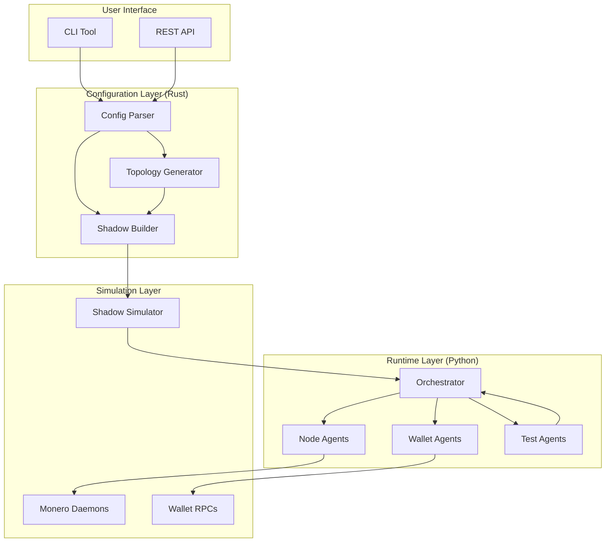
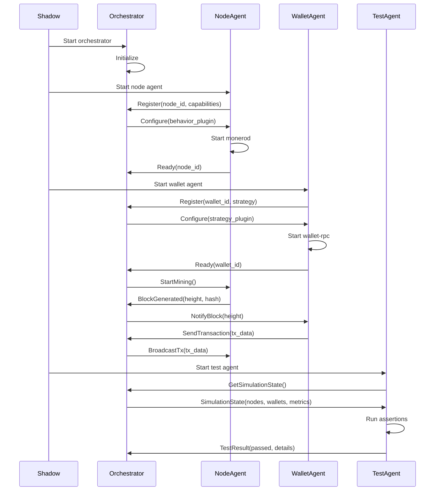
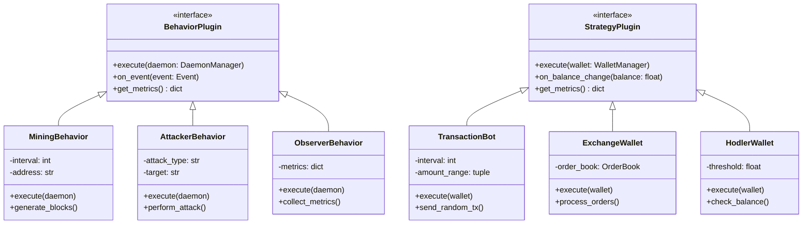
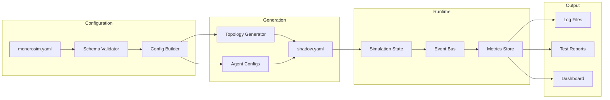
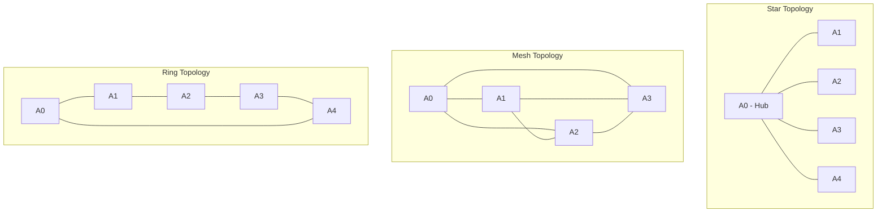
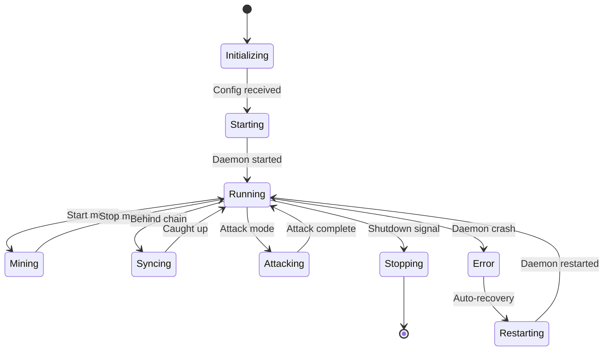
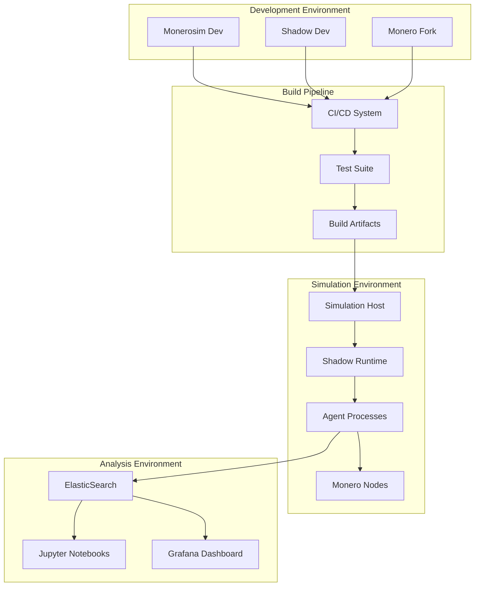
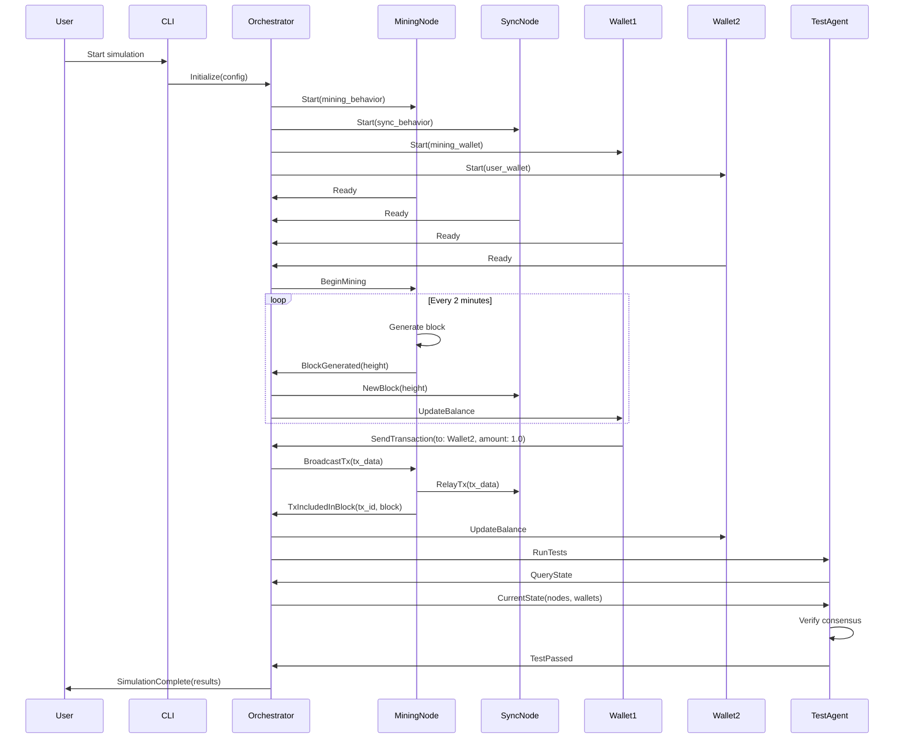
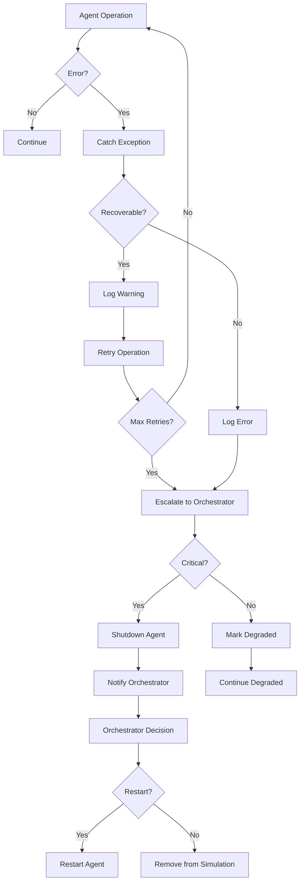

# Monerosim Architecture Diagrams

## System Overview



## Agent Architecture

```mermaid
graph TD
    subgraph "Orchestrator"
        LM[Lifecycle Manager]
        ER[Event Router]
        MM[Metrics Manager]
        API_S[API Server]
    end
    
    subgraph "Node Agent"
        DM[Daemon Manager]
        BP[Behavior Plugin]
        NM[Network Monitor]
    end
    
    subgraph "Wallet Agent"
        WM[Wallet Manager]
        SP[Strategy Plugin]
        TM[Transaction Manager]
    end
    
    subgraph "Test Agent"
        TR[Test Runner]
        AE[Assertion Engine]
        RM[Report Manager]
    end
    
    LM --> DM
    LM --> WM
    LM --> TR
    
    ER <--> BP
    ER <--> SP
    ER <--> AE
    
    MM <-- NM
    MM <-- TM
    MM <-- RM
    
    API_S --> LM
    API_S --> ER
    API_S --> MM
```

## Communication Flow



## Plugin Architecture



## Data Flow



## Network Topology Examples



## State Machine - Node Agent



## Deployment Architecture



## Message Flow Example



## Error Handling Flow



These diagrams provide a comprehensive visual representation of the refined Monerosim architecture, showing:

1. **System Overview**: High-level component relationships
2. **Agent Architecture**: Internal structure of agents
3. **Communication Flow**: Sequence of interactions
4. **Plugin Architecture**: Class hierarchy for extensibility
5. **Data Flow**: Configuration to results pipeline
6. **Network Topologies**: Supported connection patterns
7. **State Machines**: Agent lifecycle management
8. **Deployment**: Infrastructure architecture
9. **Message Flow**: Example simulation scenario
10. **Error Handling**: Fault tolerance mechanisms