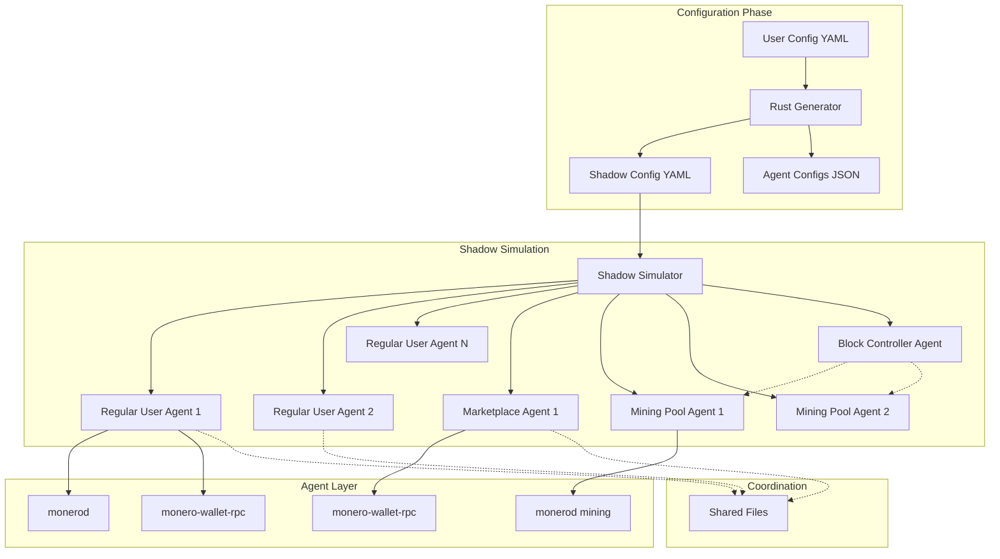
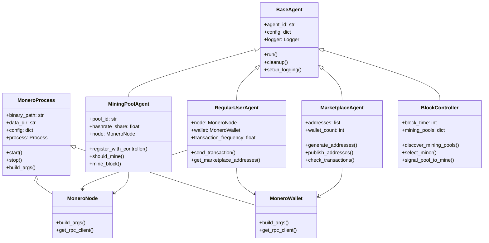
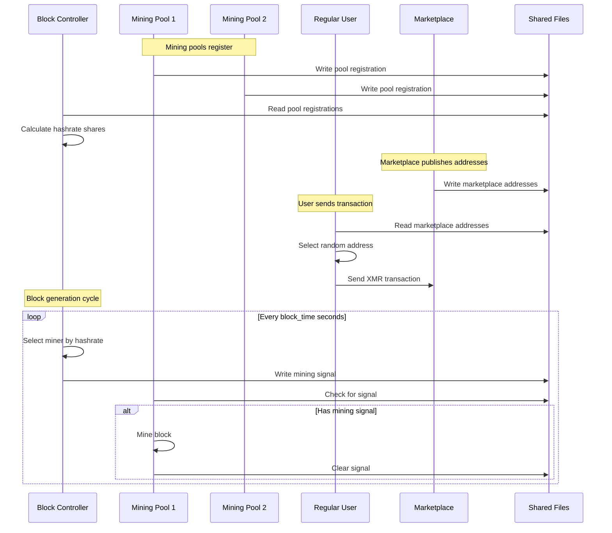
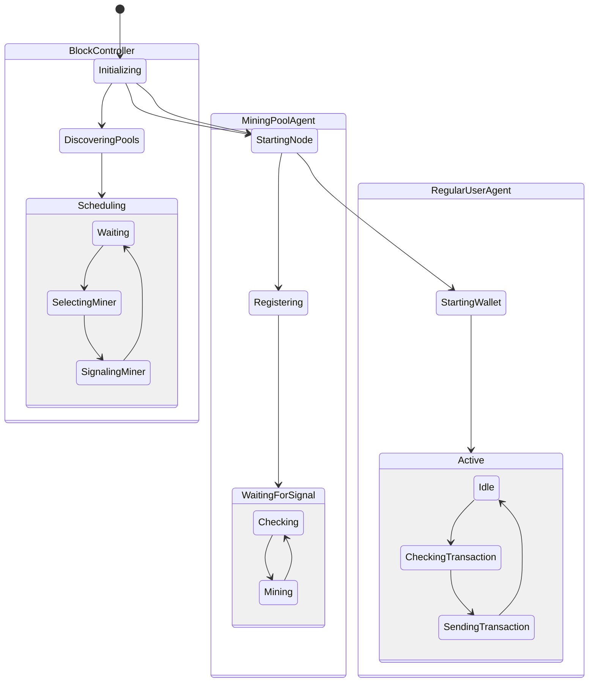
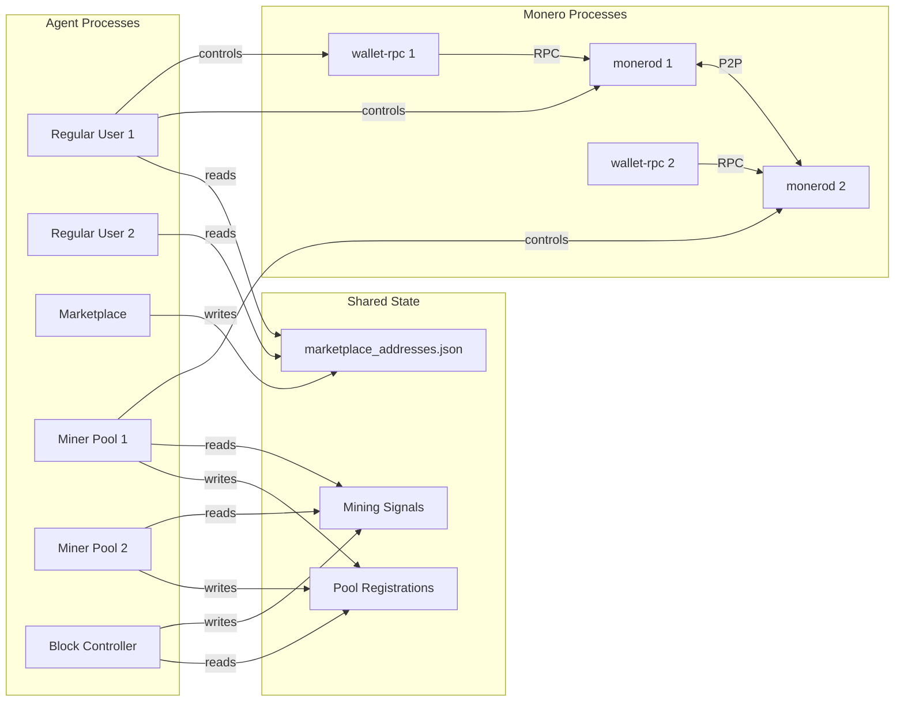
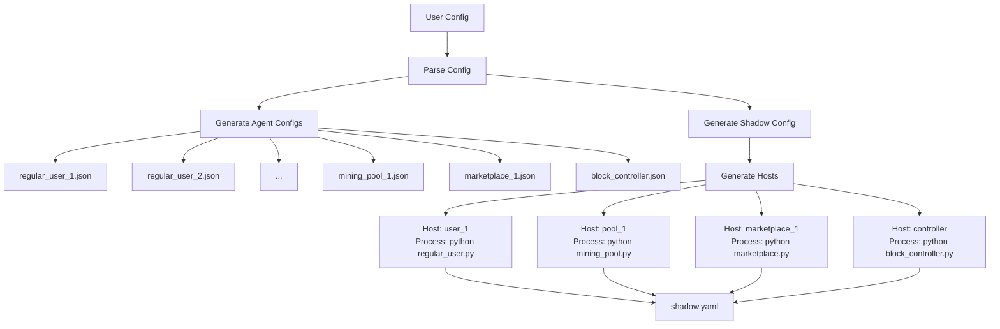
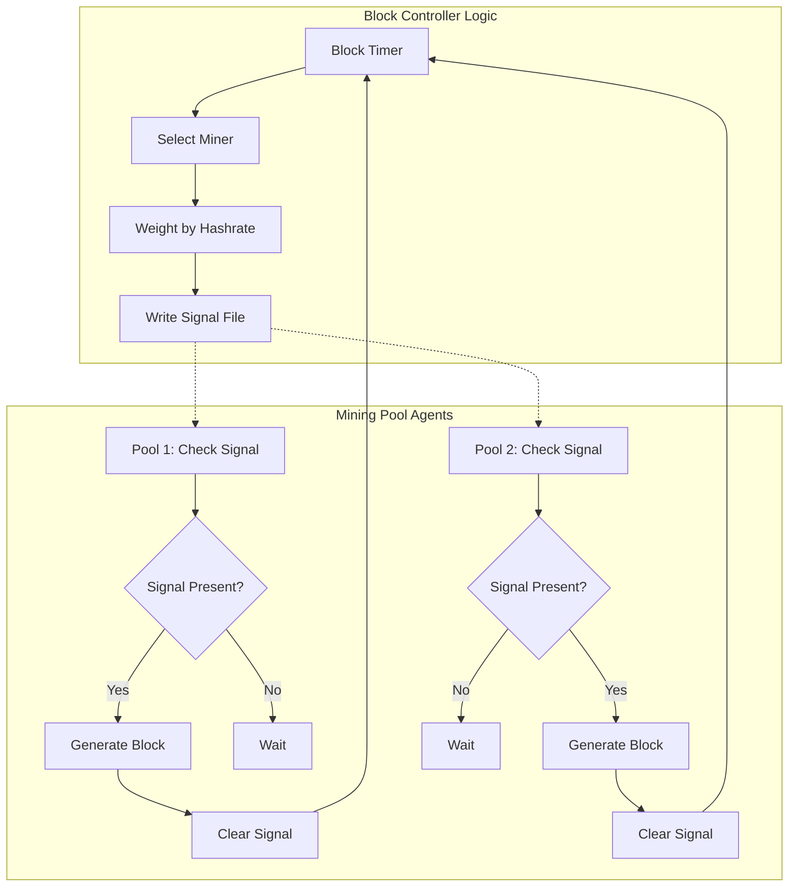
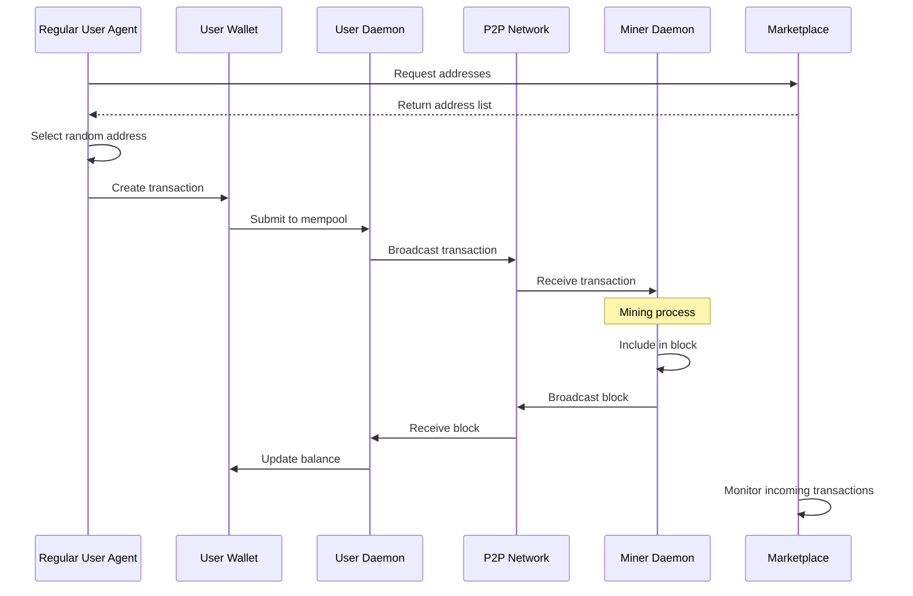
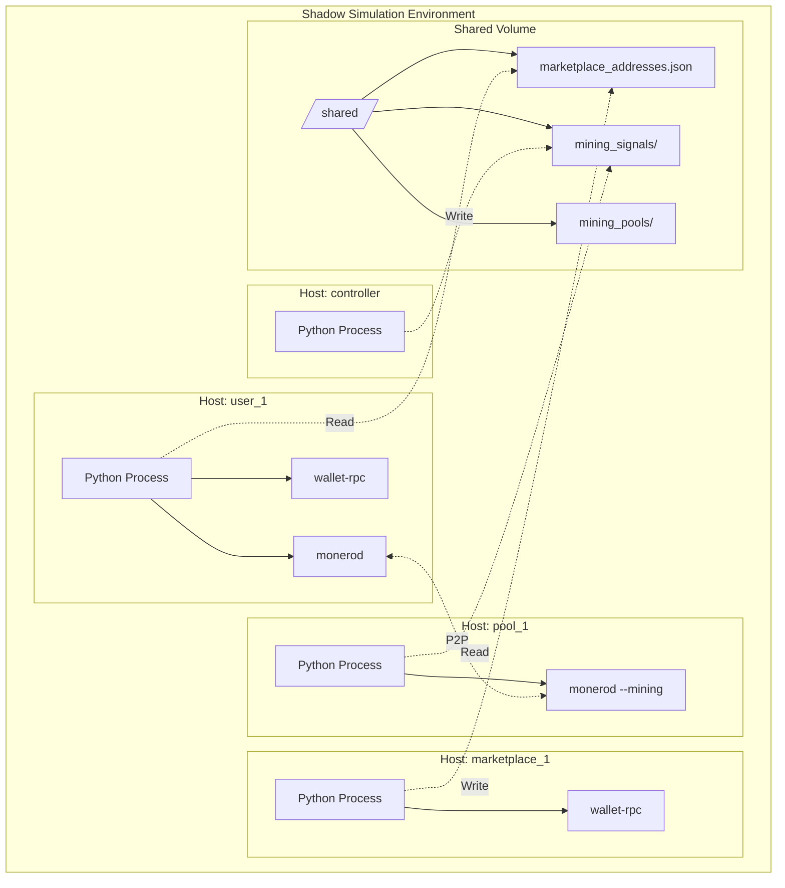

# Monerosim Architecture Diagrams V2

## System Overview

## Agent Architecture

## Agent Communication Flow

## Agent State Machine

## Data Flow Architecture

## Configuration Generation Flow

## Mining Coordination

## Transaction Flow

## Deployment Structure

## Key Design Decisions

1. **Agent-Based Architecture**: Each Shadow host runs a Python agent that represents a network participant
2. **Process Management**: Agents manage their own Monero processes (node/wallet)
3. **Shared State**: Agents communicate through shared files (Shadow-compatible)
4. **Behavioral Modeling**: Agents implement realistic participant behaviors
5. **Coordinated Mining**: Block Controller ensures realistic block generation patterns
6. **Extensibility**: New agent types can be easily added without core changes