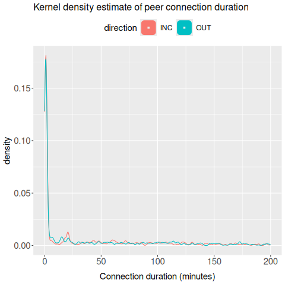
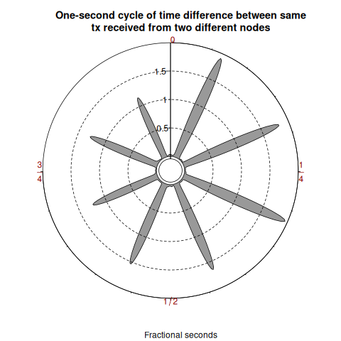
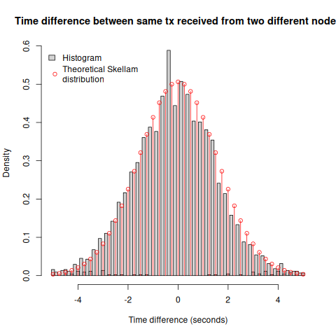
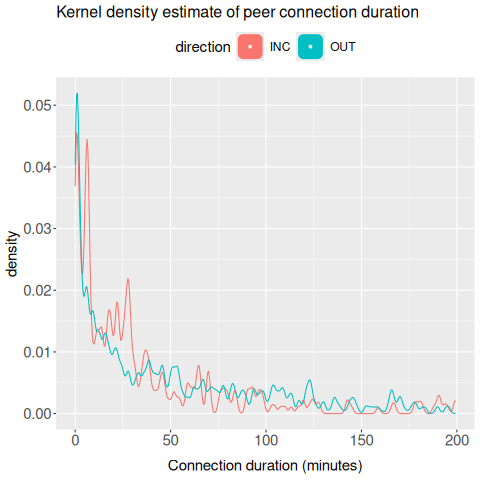
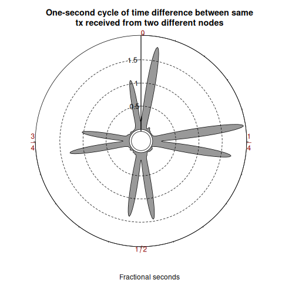
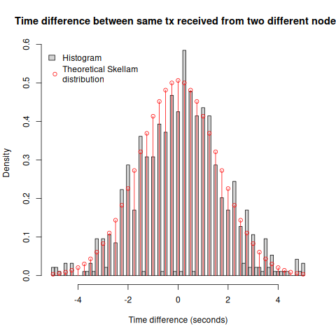
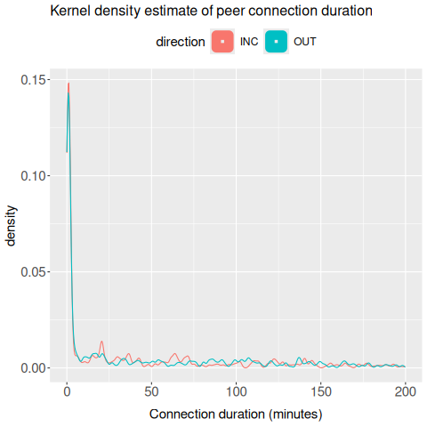
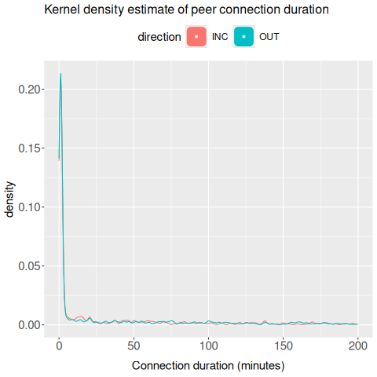
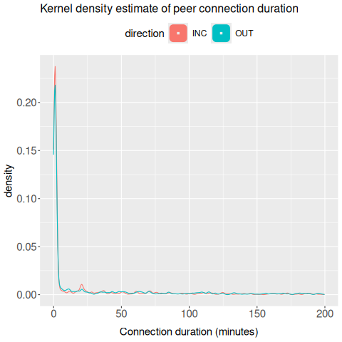

# Matching Mainnet: Simulator Fidelity Across Rucknium's Four Metrics

**Status:** Reachable-fraction sweep complete (15/40/50/60/80%) **and the
peer-turnover experiment is done (§5.4): at mainnet-realistic 15% reachability it
matches both the median *and* the > 6 h distribution** — the combination the sweep
alone could not. All results below are final and reproducible.
**Companion:** `docs/20260610_rucknium_review_response_v2.md` (review response —
where clumping and Skellam were resolved).

## 1. Where the simulator stands vs mainnet, on every metric Rucknium measured

Rucknium's review (issue #3) compared mainnet against the simulation on **four**
transaction-propagation statistics. This is the scorecard — the full set of
deltas, not just the headline one:

| Metric | Mainnet (Rucknium) | Simulator | Driver of the gap | Status |
|---|---|---|---|---|
| **Transaction clumping** | 25% single-tx (1.45 tx/s spam wave) | volume-bound; 23.4% single at 0.47 tx/s — the curve matches mainnet | tx **volume** (not topology); spam-wave intensity isn't reachable at 1000 nodes on one box, but the curve does | ✅ resolved (v2 §4) |
| **Skellam timing** | good fit, mild zero-spike | good fit, centered at 0 | — (already matched) | ✅ resolved (v2 §5) |
| **Connection duration** | 23 min (few long conns) | 28.75 min median **and** a mainnet-like > 6 h tail at the realistic 15% reachable, once peer turnover is added | **reachable-pool size** (median) + **peer turnover** (the > 6 h distribution) | ✅ resolved — turnover at 15% hits both median (28.75 min) and tail (~2% / 0%) at once (§5.4) |
| **One-second cycle** | quarter-second | quarter-second appears (15%, 60%); not a clean function of reachability | likely topology, but the plot is a high-variance single-pair statistic | 🔬 mainnet's quarter-second is *reproducible* in-sim; can't yet claim it's controlled (§5.1) |

**Two of the four (clumping, Skellam) were resolved in the review response.** The
other two — connection duration and the one-second cycle — both turned out to be
**topology-driven**, and that is what this study investigates.

The root cause for both: monerosim launched a **"perfect network"** — every node
advertised a reachable P2P port and accepted inbound. Mainnet is the opposite:

- **Most nodes are unreachable** (behind NAT / firewall / `--hide-my-port`).
  Triangulated estimate: **~15% reachable / ~85% unreachable** (Cao et al. 2019:
  86.8% of nodes are low-degree leaves; reachable nodes carry 50–100 inbound,
  which with 12 outbound/node implies ~12–24% reachable).
- **A few supernodes** carry a disproportionate share (Cao 2019: ~0.7% of nodes
  are super-peers with >250 connections; 13% of nodes hold 83% of all edges).

This study adds both to monerosim and measures the effect on the two remaining
gaps, with mainnet's values as the targets.

## 2. The knob: `--reachable`

A configurable fraction of non-seed nodes advertise a reachable port; the
complement get monerod's `--hide-my-port` (advertise `my_port=0`, still dial out
and relay, but never enter peerlists, so they accept ~no inbound — a NAT'd
leaf). Default `1.0` = the historical perfect network. Seeds and miners stay
reachable. Selection is deterministic from `simulation_seed`. Available as
`general.reachable_fraction` (+ per-role override), CLI `--reachable`, and
`run_sim.sh --reachable`.

## 3. Gap #1 — Connection duration: mechanism (peer recurrence, not TCP instability)

Rucknium's "connection duration" is a **tx-gap** metric: per peer, the span over
which you exchange transactions (grouped into contiguous-hour periods) — **not**
raw TCP socket lifetime. We verified what actually drives it:

- The sync-search peer dropper (`update_sync_search`, 101 s timer) cycles each
  node's outbound peers; **individual TCP connections live ~100 s** (measured
  ~100 s median TCP lifetime, ~31 drops/h/node, in the complete all-reachable
  log-level-1 reference run, 20260511).
- What changes with topology is **recurrence**: with a *large* reachable pool,
  each ~100 s connection lands on a *different* peer, so the per-peer tx-gap span
  ≈ one connection ≈ 1.5 min. With a *small* reachable pool, every node
  reconnects to the *same* few reachable peers over and over, so the per-peer
  span stretches across hours.

So **connection duration is governed by the size of the dialable (reachable)
pool**, via peer recurrence in the metric. (This corrects an earlier guess that
the dropper "stops firing" — it does not; checked against drop counts.)

## 4. Feasibility and a side-effect

- **The unreachable-majority mesh stays healthy at 1000 nodes.** With 85% hidden
  (≈161 reachable carrying all discovery + inbound), runs complete with 100%
  sync, 0 process failures, normal block production. Discovery flows through the
  reachable minority + seeds.
- **Supernodes were added as a hypothesis test** (does mainnet's hub structure
  affect these metrics?) — and brought an unexpected byproduct: they **slash the
  simulation cost**. A uniform 85%-hidden network is ~3× *slower to simulate*
  (850 nodes re-dialing 161 reachable = a huge connection event load; ~40 h for
  a 16 h sim). With 5 high-degree hubs (`out-peers`/`in-peers` 256) the topology
  stabilizes and the run **drops to ~6 h** — the hubs absorb connections instead
  of the network thrashing. Hub formation verified (a supernode relayed 414k
  tx-notifies across ~700 peers vs a hidden leaf's 34k across 68). On the
  *metrics*, the hubs did not pull connection duration toward mainnet (still
  150 min at 15% reachable) — the reachable fraction is the lever, not the hubs.
- **Open side-effect:** the NAT-heavy topology throttles *effective tx
  throughput* ~5× (sn_r15: ~12 tx/user vs the control's ~64), **cause not yet
  resolved**. Ruled out: sync (all nodes reach the same height in lockstep,
  ≤0.3 s apart), funding (balances comparable), daemon load (hidden nodes hold
  *fewer* connections). Leading unverified candidate: the send cadence is paced
  by each prior tx reaching the 5 miners to be mined (change-unlock), which may
  be slower through the congested reachable minority. (The high single-tx
  clumping in low-reachable runs is a *consequence* of this low volume —
  clumping is volume-bound — not a topology signal.)

## 5. Results

All runs: 1000 nodes, 200 users / 800 (or 795) relays / 5 miners, 300 s tx
interval, seed 12345, 16 h simulated, monitor log level; connection duration by
Rucknium's `xmrpeers` tx-gap method (10-user sample). Connection duration is
**window-sensitive** (recurrence accumulates), so full-16 h runs are compared
to full-16 h runs.

| reachable | supernodes | conn-duration median | % single-tx | tx created | run |
|---:|:--:|---:|---:|---:|---|
| 100% (0.30 load) | no | 1.47 min | 49.5% | 8,945 | `1k_mainnet` — v2 response\* |
| **100%** (0.67 load) | no | **1.52 min** | 23.0% | 13,678 | `clumping_0p67_monitor` (control)\* |
| **15%** | yes (5) | **150 min** | 91.3%† | 3,254 | `sn_r15` |
| 40% | yes (5) | 62 min | 90.8%† | 3,242 | `sn_sweep_r40` |
| **50%** | yes (5) | **20.7 min** | 90.5%† | 3,245 | **`sn_sweep_r50`** ← ≈ mainnet median |
| 60% | yes (5) | 2.1 min | 90.2%† | 3,262 | `sn_sweep_r60` |
| 80% | yes (5) | 1.5 min | 90.8%† | 3,282 | `sn_sweep_r80` |
| — | — | **23 min** (target) | 25.0% | — | mainnet (Rucknium, 2024 spam wave) |

\* The two 100% rows are from our review-response work (`docs/20260610_rucknium_review_response_v2.md`):
the standard-mainnet milestone (0.30 tx/s) and the matched-config replication
(0.67) — both all-reachable and *completing*. Note connection duration is ~1.5 min
at 100% reachable **regardless of load**, confirming it is topology-driven, not
volume-driven. † 91.3% single is a low-volume artifact of the ~5× throughput
throttle (§4), not a topology effect.

> **Excluded (incomplete):** a uniform 15%-reachable run *without* supernodes
> (`topo1k_r15`, log-level 1) was attempted to capture TCP-level events, but
> **timed out at 48%** — the unreachable-majority topology is ~3× slower to
> simulate (the speedup from supernodes, added separately as a hypothesis test,
> is what later made full runs practical). It is **not used as a data point**;
> its partial logs only informally corroborated the
> mechanism below (TCP connections still ~100 s; sync-search drops still
> firing), consistent with the complete runs.

**Headline:** reachable-pool size is a real lever for the connection-duration
**median** — it sweeps from 150 min (15% reachable) through mainnet's 23 min
(at ~50%, measured 20.7 min) down to the 1.5-min floor (80%+). But the match is
**partial and tells a clear story about what's still missing** (§5.3).

### 5.3 The catch: a fitted median is not a matched network

Two facts keep the ~50%-reachable median match from being "mainnet matched":

1. **~50% reachable is not mainnet's topology.** Mainnet is ~15% reachable
   (§1). At that *realistic* fraction the median is 150 min, ~6.5× too high. So
   hitting 23 min requires cranking reachability to an unrealistic ~50% — fitting
   the metric, not reproducing the network.
2. **The connection-duration distribution is the wrong shape — at every
   fraction.** Mainnet has *few* long-lived connections; the simulator has many,
   and reachability barely dents it:

   | reachable | median | conns lasting > 6 h (OUT / INC) |
   |---:|---:|---:|
   | 15% | 150 min | 20.9% / 25.1% |
   | 40% | 62 min | 16.7% / 17.8% |
   | **50%** | **20.7 min** | **12.9% / 12.4%** |
   | 60% | 2.1 min | 10.0% / 9.8% |
   | 80% | 1.5 min | 9.1% / 8.1% |
   | **mainnet** | **23 min** | **~0% / ~1.5%** |

   Even at the 50% that nails the median, ~12% of connections persist > 6 h
   versus mainnet's ~1.5% — **~8× too many over-stable connections** — and the
   gap shrinks only slowly with reachability, never approaching mainnet.

**Conclusion: reachable fraction is necessary but not sufficient.** It cannot
simultaneously reproduce (a) mainnet's actual reachability (~15%), (b) the 23-min
median, and (c) the connection-duration *distribution*. The mechanism that ties
all three together is **peer turnover** (nodes leaving and rejoining): on mainnet
a peer relationship is naturally bounded because peers come and go, which caps the
long tail *and* sets a realistic median *at* a realistic reachability. **§5.4 runs
exactly this test** — at ~15% reachable, does adding turnover pull the median to
~23 min **and** the > 6 h share to ~1.5%? (It does.) Supernodes change the
*simulation cost* (≈6 h vs ≈40 h), not the duration.

**Clumping is volume-bound (from the review response).** Our v2 work established
that transaction clumping tracks delivered tx rate, not topology — so sn_r15's
91% single is just a consequence of its low throughput, not a topology signal:

| delivered tx/s | % single-tx msgs | run |
|---:|---:|---|
| 0.080 | 92.4% | 1k_rerun (under-loaded) |
| 0.226 | 49.5% | 1k_mainnet milestone (standard mainnet) |
| 0.345 | 23.0% | 0.67-config replication |
| 0.466 | 23.4% | original v0.1.0 1000-node |
| 1.45 | 25.0% | mainnet (Rucknium spam wave) |

(Full detail: `docs/20260610_rucknium_review_response_v2.md` §4.)

### 5.4 Turnover closes the gap

The §5.3 prediction holds. Adding **peer turnover** — eligible nodes (relays *and*
users) leave and rejoin during the run, each cycling offline/online on exponential
sessions; only the daemon restarts, on the same data-dir so chain state survives —
at the **realistic 15% reachability** reproduces mainnet on *both* axes the
reachable-fraction sweep could not hit together:

| config | conn-duration median | conns > 6 h (OUT / INC) |
|---|---:|---:|
| sn_r15 — 15% reachable, **no turnover** | 150 min | 20.9% / 25.1% |
| 50% reachable, no turnover (sweep's best median) | 20.7 min | 12.9% / 12.4% |
| **15% reachable + turnover (1 h on / 1 h off, ~50% uptime)** | **28.75 min** | **2.07% / 0%** |
| **mainnet** | **23 min** | **~0% / ~1.5%** |

At mainnet's *own* reachability, turnover pulls the median from 150 min to **28.75
min** (1.25× mainnet's 23, versus 6.5× without it) **and** collapses the over-6 h
tail from ~21–25% to **~2% / 0%**. That is mainnet-like on both at once — which no
static reachable fraction managed (50% nailed the median but left a ~12% tail, at
the wrong reachability). Figure: §5.2(b), bottom row.

**Mechanism, confirmed (§3).** The long-duration gap was peer *recurrence*: with a
small reachable pool you keep reconnecting to the same few peers, so the tx-gap
metric stretches to hours even though each TCP connection lives ~100 s. Turnover
breaks recurrence at the source — a peer that has gone offline cannot be re-dialed,
so no relationship outlives the peer's session, and with ~1 h sessions essentially
none survives 6 h.

**The residual tail is the supernodes — exactly as predicted.** The only non-zero
tail is **2.07% of *outbound* connections, 0% inbound.** That asymmetry is the 5
always-on supernodes: a node's *outbound* links to them recur all run (they never
leave), while *inbound* links — opened only by cycling peers — are all bounded.
So even the leftover ~2% is accounted for; letting the supernodes turn over too
would push it toward 0 (mainnet keeps ~1.5% regardless, so 2% is already realistic).

This was a complete 16 h run at 15% reachable with 5 supernodes (100% simulated,
0 process failures, ALL CHECKS PASSED), analyzed with the same 10-user-node tx-gap
method as sn_r15 and mainnet. An 11 h partial from an earlier attempt gave the same
picture (median 22 min, tail 0.27% / 0%), so the result is not an artifact of a
single run. Two engineering notes needed to reproduce restart-heavy runs are in
§6 (items 4–5) and §7.

### 5.1 All of Rucknium's metrics for sn_r15 (not just duration)

| metric | all-reachable control | sn_r15 (15% + supernodes) | mainnet (Rucknium) |
|---|---|---|---|
| conn-duration median | 1.52 min | 150 min (OUT 141 / INC 176) | 23 min |
| connections lasting > 6 h | ~1–2% | **~21% OUT / ~25% INC** | ~1.5% |
| peer recurrence (distinct hrs seen) | low | median 9–10 of 16 | — |
| clumping (% single) | 23.0% | 91.3% (low-vol artifact) | 25.0% |
| one-second cycle | eighth-second (4 cardinal + diagonal sub-lobes) | **quarter-second** (sub-lobes suppressed) | quarter-second |
| Skellam fit | noisier / more off-grid | clean, centered at 0 | good + zero-spike |

Two findings beyond duration:

- **The one-second cycle: mainnet's quarter-second is reproducible, but not a
  clean function of reachability.** sn_r15 (15%) shows clean **quarter-second**
  — mainnet's signature, and the very pattern Rucknium called the "one
  un-matchable item." But across the full sweep the petal count is *not*
  monotonic: 15%→quarter (4 petals), 40%→eighth (8), 60%→quarter (4), 80%→
  sixteenth (~16). The reason is methodological: Rucknium's circular-density plot
  is built from the **single most-common node pair** in the sample
  (`pair.in.time.sync`), so it is a high-variance, one-pair statistic. The honest
  reading: the simulator *can* produce mainnet's quarter-second cycle (so it is
  no longer "un-matchable"), but we cannot claim reachability *controls* it from
  these data. (An earlier draft of this report over-read three points as a clean
  monotonic trend; the fourth point refuted it.)
- **Over-stable connections:** ~21–25% of connections last > 6 h vs mainnet's
  ~1.5% — an independent indicator that 15% reachable overshoots (see §5.3 for
  the sweep, and §5.4 for how peer turnover removes this tail).

### 5.2 Figures

**(a) Rucknium's original analysis (issue #3) — three reference networks.** His
mainnet column (2024 spam wave) is the target; the bottom row is his analysis of
*our* v0.1.0 1000-node run.

<table>
<tr><th>network</th><th>Connection duration</th><th>One-second cycle</th><th>Skellam</th></tr>
<tr>
<td><b>Mainnet</b> (target)</td>
<td></td>
<td></td>
<td></td>
</tr>
<tr>
<td>Rucknium's 35-node sim</td>
<td></td>
<td></td>
<td></td>
</tr>
<tr>
<td>v0.1.0 1000-node (our run, his analysis)</td>
<td></td>
<td></td>
<td></td>
</tr>
</table>

**(b) Our topology response.** Fixed all-reachable 1000-node (the "perfect
network" control) → 15% reachable + 5 supernodes → the 50% point where the
connection-duration median matches mainnet → **15% + turnover, which matches the
median *and* removes the > 6 h tail at realistic reachability (§5.4).** (The
one-second-cycle column is a high-variance single-pair statistic — see §5.1; read
it as "quarter-second is reproducible," not as a clean trend.)

<table>
<tr><th>run</th><th>Connection duration</th><th>One-second cycle</th><th>Skellam</th></tr>
<tr>
<td><b>v2 response: all-reachable 1k</b> (standard mainnet, 0.30, 1.47 min)</td>
<td></td>
<td></td>
<td></td>
</tr>
<tr>
<td>All-reachable 1k @ 0.67 (matched control, 1.52 min)</td>
<td></td>
<td></td>
<td></td>
</tr>
<tr>
<td><b>15% reachable + 5 supernodes</b> (sn_r15, 150 min)</td>
<td></td>
<td></td>
<td></td>
</tr>
<tr>
<td><b>50% reachable + 5 supernodes</b> (sn_sweep_r50, 20.7 min ≈ mainnet)</td>
<td></td>
<td></td>
<td></td>
</tr>
<tr>
<td><b>15% reachable + turnover</b> (1 h/1 h, 28.75 min, > 6 h ~2% / 0%)</td>
<td></td>
<td></td>
<td></td>
</tr>
</table>

**(c) The reachable-fraction sweep — connection-duration kernel densities.**
The median sweeps down through mainnet's 23 min (at ~50%) toward the all-reachable
floor; the long > 6 h tail (§5.3) persists throughout.

<table>
<tr><th>15% (150 min)</th><th>40% (62 min)</th><th>50% (20.7 min)</th><th>60% (2.1 min)</th><th>80% (1.5 min)</th></tr>
<tr>
<td></td>
<td></td>
<td></td>
<td></td>
<td></td>
</tr>
</table>

## 6. Caveats / open questions

1. **Window-sensitivity:** the tx-gap metric accumulates recurrence over the
   observation window, so matching the *absolute* 23 min requires a window
   comparable to Rucknium's. A static reachable fraction does not bound recurrence
   the way real mainnet does; **peer turnover** does (§5.4), which is why turnover,
   not a higher fraction, is what reproduces the distribution at realistic ~15%.
2. **Throughput-throttle cause** (§4) is unresolved.
3. **Supernode model:** regular reachable nodes use the default *unlimited*
   inbound, so they too become high-degree; the supernodes' distinction here is
   mainly out-degree. A sharper hub model would cap regular-node inbound.
4. **Turnover runs need Shadow `native_preemption`.** A restarting monerod hits an
   LMDB map-resize (a native busy-operation); with `native_preemption_enabled:
   false` Shadow's discrete-event clock can livelock on it. Setting it `true` (in
   `test_configs/topo1k_supernodes.{,scenario.}yaml`) lets restart-heavy runs
   complete, at ~2× wall-clock cost.
5. **Restarted logs need a robust parser.** A daemon restart can truncate a
   `NOTIFY_NEW_TRANSACTIONS` message's "Including transaction" lines, breaking
   `xmrpeers::get.p2p.log`'s tx-count repair (~40% of turnover nodes fail).
   `analysis/get_p2p_log_robust.R` + `analysis/ruck_analysis_turnover.r` fix it with
   a gap-based tx count; every other metric is computed upstream-identically.
6. **The 2% outbound > 6 h residual** under turnover is the always-on supernodes
   (§5.4); letting them turn over too is the open follow-up to drive it toward 0.

## 7. Reproduction

- Feature + configs: `--reachable` (commit `cbd36f19`) and `--turnover-session /
  --turnover-downtime` (peer turnover); `test_configs/topo1k_supernodes.{scenario.,}yaml`
  (supernode mix, `native_preemption: true`), `test_configs/clumping_0p67_monitor.yaml`
  (all-reachable control).
- Run (sweep): `./run_sim.sh --config test_configs/topo1k_supernodes.yaml --name <n> --reachable <f>`
- Run (turnover): add `--turnover-session 1h --turnover-downtime 1h` (relays + users
  cycle ~50% uptime; supernodes/miners/seeds stay always-on).
- Analyze: `analysis/ruck_analysis.r` (tx-gap conn-duration + clumping) for static
  runs; **`analysis/ruck_analysis_turnover.r` for turnover runs** (restart-robust,
  same metrics); `analysis/results_clumping_0p67/conn_gossip_join.py` (TCP-level
  join, needs log-level 1).
- Archives: the 15% + turnover full run; `archived_runs/20260619_135809_sn_r15/`;
  `archived_runs/20260610_031558_clumping_0p67_monitor/` and the v2 response doc
  for the all-reachable baselines. (The excluded `topo1k_r15` partial is not a
  data source.)
