# Network Topology Realism: Reachability, Supernodes, and Connection Duration

**Status:** Living report — reachable-fraction sweep in progress (§5 table has
TBD rows). Everything else is final and reproducible.
**Companion:** follows up the connection-duration finding in
`docs/20260610_rucknium_review_response_v2.md` §3/§10.

## 1. Motivation

Rucknium's review (issue #3) flagged that the 1000-node simulation's peer
**connection duration** (~1.5 min, by his tx-gap method) was far below
mainnet's ~23 min. We traced that to an *environmental* difference: monerosim
launched a **"perfect network"** — every node advertises a reachable P2P port
and accepts inbound. Mainnet is the opposite:

- **Most nodes are unreachable** (behind NAT / firewall / `--hide-my-port`).
  Triangulated estimate: **~15% reachable / ~85% unreachable** (Cao et al. 2019
  found 86.8% of nodes are low-degree leaves; reachable nodes carry 50–100
  inbound, which with 12 outbound/node implies ~12–24% reachable).
- **A few supernodes** carry a disproportionate share (Cao 2019: ~0.7% of nodes
  are super-peers with >250 connections; 13% of nodes hold 83% of all edges).

This study adds both to monerosim and measures the effect on connection
duration, with mainnet's 23 min as the target.

## 2. The knob: `--reachable`

A configurable fraction of non-seed nodes advertise a reachable port; the
complement get monerod's `--hide-my-port` (advertise `my_port=0`, still dial out
and relay, but never enter peerlists, so they accept ~no inbound — a NAT'd
leaf). Default `1.0` = the historical perfect network. Seeds and miners stay
reachable. Selection is deterministic from `simulation_seed`. Available as
`general.reachable_fraction` (+ per-role override), CLI `--reachable`, and
`run_sim.sh --reachable`.

## 3. The mechanism (verified): peer recurrence, not TCP instability

Rucknium's "connection duration" is a **tx-gap** metric: per peer, the span over
which you exchange transactions (grouped into contiguous-hour periods) — **not**
raw TCP socket lifetime. We verified what actually drives it:

- The sync-search peer dropper (`update_sync_search`, 101 s timer) cycles each
  node's outbound peers; **individual TCP connections live ~100 s** (measured
  ~100 s median TCP lifetime, ~31 drops/h/node, in the complete all-reachable
  log-level-1 reference run, 20260511).
- What changes with topology is **recurrence**: with a *large* reachable pool,
  each ~100 s connection lands on a *different* peer, so the per-peer tx-gap span
  ≈ one connection ≈ 1.5 min. With a *small* reachable pool, every node
  reconnects to the *same* few reachable peers over and over, so the per-peer
  span stretches across hours.

So **connection duration is governed by the size of the dialable (reachable)
pool**, via peer recurrence in the metric. (This corrects an earlier guess that
the dropper "stops firing" — it does not; checked against drop counts.)

## 4. Feasibility and a side-effect

- **The unreachable-majority mesh stays healthy at 1000 nodes.** With 85% hidden
  (≈161 reachable carrying all discovery + inbound), runs complete with 100%
  sync, 0 process failures, normal block production. Discovery flows through the
  reachable minority + seeds.
- **Supernodes fix the simulation cost.** A uniform 85%-hidden network is ~3×
  *slower to simulate* (850 nodes re-dialing 161 reachable = a huge connection
  event load; ~40 h for a 16 h sim). Adding 5 high-degree hubs (`out-peers`/
  `in-peers` 256) stabilizes the topology and **cuts that to ~6 h** — the hubs
  absorb connections instead of the network thrashing. Hub formation verified
  (a supernode relayed 414k tx-notifies across ~700 peers vs a hidden leaf's
  34k across 68).
- **Open side-effect:** the NAT-heavy topology throttles *effective tx
  throughput* ~5× (sn_r15: ~12 tx/user vs the control's ~64), **cause not yet
  resolved**. Ruled out: sync (all nodes reach the same height in lockstep,
  ≤0.3 s apart), funding (balances comparable), daemon load (hidden nodes hold
  *fewer* connections). Leading unverified candidate: the send cadence is paced
  by each prior tx reaching the 5 miners to be mined (change-unlock), which may
  be slower through the congested reachable minority. (The high single-tx
  clumping in low-reachable runs is a *consequence* of this low volume —
  clumping is volume-bound — not a topology signal.)

## 5. Results

All runs: 1000 nodes, 200 users / 800 (or 795) relays / 5 miners, 300 s tx
interval, seed 12345, 16 h simulated, monitor log level; connection duration by
Rucknium's `xmrpeers` tx-gap method (10-user sample). Connection duration is
**window-sensitive** (recurrence accumulates), so full-16 h runs are compared
to full-16 h runs.

| reachable | supernodes | conn-duration median | % single-tx | tx created | run |
|---:|:--:|---:|---:|---:|---|
| 100% (0.30 load) | no | 1.47 min | 49.5% | 8,945 | `1k_mainnet` — v2 response\* |
| **100%** (0.67 load) | no | **1.52 min** | 23.0% | 13,678 | `clumping_0p67_monitor` (control)\* |
| **15%** | **yes (5)** | **150 min** | 91.3%† | 3,254 | **`sn_r15`** (2026-06-19) |
| 40% | yes (5) | _TBD_ | _TBD_ | _TBD_ | sweep (running) |
| 60% | yes (5) | _TBD_ | _TBD_ | _TBD_ | sweep (running) |
| 80% | yes (5) | _TBD_ | _TBD_ | _TBD_ | sweep (running) |
| — | — | **23 min** (target) | 25.0% | — | mainnet (Rucknium, 2024 spam wave) |

\* The two 100% rows are from our review-response work (`docs/20260610_rucknium_review_response_v2.md`):
the standard-mainnet milestone (0.30 tx/s) and the matched-config replication
(0.67) — both all-reachable and *completing*. Note connection duration is ~1.5 min
at 100% reachable **regardless of load**, confirming it is topology-driven, not
volume-driven. † 91.3% single is a low-volume artifact of the ~5× throughput
throttle (§4), not a topology effect.

> **Excluded (incomplete):** a uniform 15%-reachable run *without* supernodes
> (`topo1k_r15`, log-level 1) was attempted to capture TCP-level events, but
> **timed out at 48%** — the unreachable-majority topology is ~3× slower to
> simulate, which is precisely what motivated adding supernodes. It is **not
> used as a data point**; its partial logs only informally corroborated the
> mechanism below (TCP connections still ~100 s; sync-search drops still
> firing), consistent with the complete runs.

**Headline so far:** topology (reachable-pool size) moves connection duration
from 1.5 min (all-reachable) to 150 min (15% reachable) — ~100× — confirming it
is the lever. 15% **overshoots** mainnet's 23 min; the realistic fraction is
**higher**. The running sweep (40/60/80%) pinpoints where it crosses 23 min.
Supernodes change the *simulation cost*, not the duration.

**Clumping is volume-bound (from the review response).** Our v2 work established
that transaction clumping tracks delivered tx rate, not topology — so sn_r15's
91% single is just a consequence of its low throughput, not a topology signal:

| delivered tx/s | % single-tx msgs | run |
|---:|---:|---|
| 0.080 | 92.4% | 1k_rerun (under-loaded) |
| 0.226 | 49.5% | 1k_mainnet milestone (standard mainnet) |
| 0.345 | 23.0% | 0.67-config replication |
| 0.466 | 23.4% | original v0.1.0 1000-node |
| 1.45 | 25.0% | mainnet (Rucknium spam wave) |

(Full detail: `docs/20260610_rucknium_review_response_v2.md` §4.)

### 5.1 All of Rucknium's metrics for sn_r15 (not just duration)

| metric | all-reachable control | sn_r15 (15% + supernodes) | mainnet (Rucknium) |
|---|---|---|---|
| conn-duration median | 1.52 min | 150 min (OUT 141 / INC 176) | 23 min |
| connections lasting > 6 h | ~1–2% | **~21% OUT / ~25% INC** | ~1.5% |
| peer recurrence (distinct hrs seen) | low | median 9–10 of 16 | — |
| clumping (% single) | 23.0% | 91.3% (low-vol artifact) | 25.0% |
| one-second cycle | eighth-second (4 cardinal + diagonal sub-lobes) | **quarter-second** (sub-lobes suppressed) | quarter-second |
| Skellam fit | noisier / more off-grid | clean, centered at 0 | good + zero-spike |

Two findings beyond duration:

- **The one-second cycle moved toward mainnet.** The all-reachable sim shows the
  eighth-second sub-lobes Rucknium called the "one un-matchable item"; sn_r15
  shows clean **quarter-second**, mainnet's signature. The Skellam fit is also
  cleaner. **Caveat:** sn_r15's ~5× lower tx volume is a confound (less data →
  sparser one-second plot, smoother Skellam), so this is *not yet* attributable
  to topology vs volume. The sweep disentangles it: if the quarter-second
  persists at 60–80% reachable (where volume recovers), it's a topology effect;
  if it reverts to eighth-second, it was a volume artifact. **[to verify on sweep]**
- **Over-stable connections:** ~21–25% of connections last > 6 h vs mainnet's
  ~1.5% — an independent indicator that 15% reachable overshoots.

### 5.2 Figures

**(a) Rucknium's original analysis (issue #3) — three reference networks.** His
mainnet column (2024 spam wave) is the target; the bottom row is his analysis of
*our* v0.1.0 1000-node run.

<table>
<tr><th>network</th><th>Connection duration</th><th>One-second cycle</th><th>Skellam</th></tr>
<tr>
<td><b>Mainnet</b> (target)</td>
<td>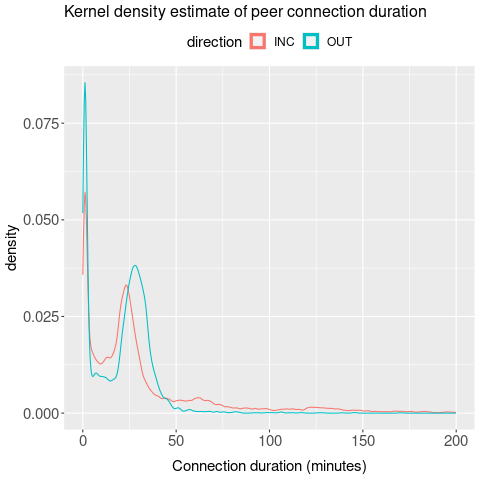</td>
<td>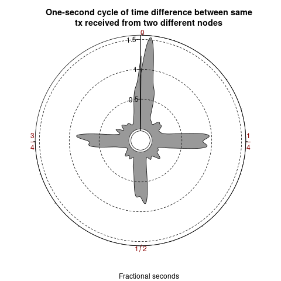</td>
<td>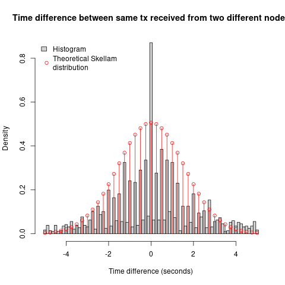</td>
</tr>
<tr>
<td>Rucknium's 35-node sim</td>
<td>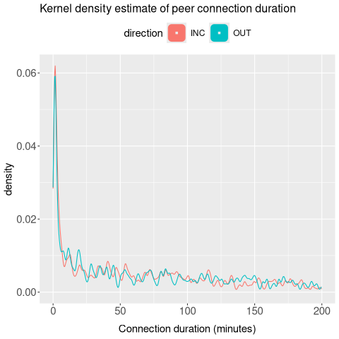</td>
<td>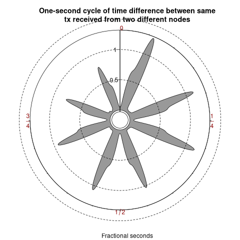</td>
<td>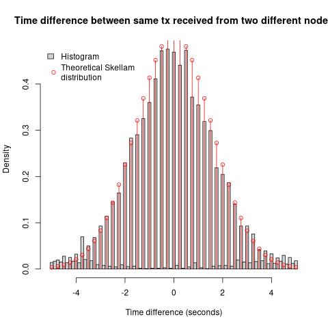</td>
</tr>
<tr>
<td>v0.1.0 1000-node (our run, his analysis)</td>
<td>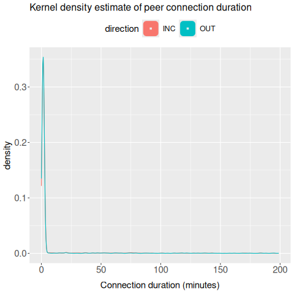</td>
<td>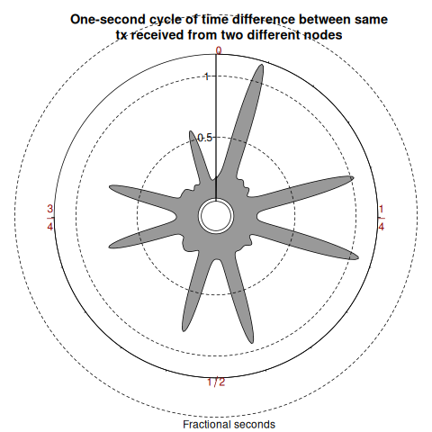</td>
<td>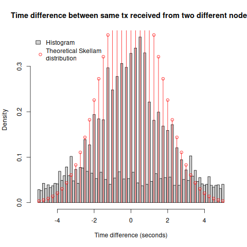</td>
</tr>
</table>

**(b) Our topology response.** Fixed all-reachable 1000-node (the "perfect
network" control) → 15% reachable + 5 supernodes (this study's new run) →
reachable-fraction sweep (in progress). Watch the **one-second-cycle** column:
mainnet is quarter-second, the all-reachable control is eighth-second, and
sn_r15 returns to quarter-second (volume-confound caveat in §5.1).

<table>
<tr><th>run</th><th>Connection duration</th><th>One-second cycle</th><th>Skellam</th></tr>
<tr>
<td><b>v2 response: all-reachable 1k</b> (standard mainnet, 0.30, 1.47 min)</td>
<td></td>
<td>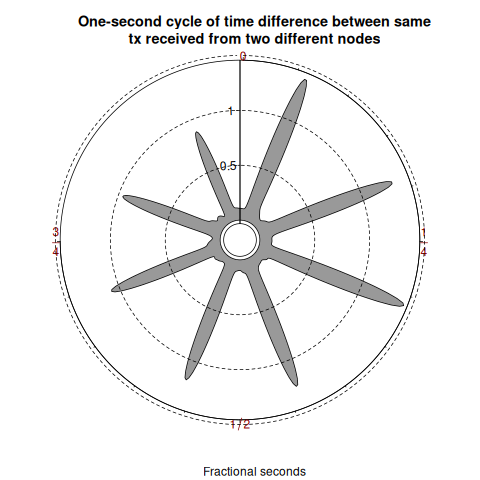</td>
<td>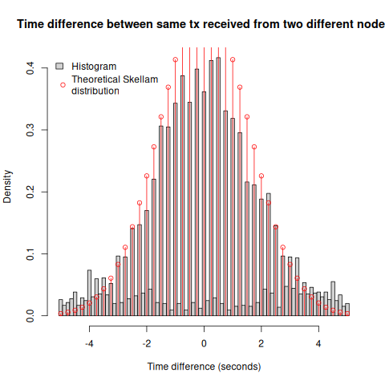</td>
</tr>
<tr>
<td>All-reachable 1k @ 0.67 (matched control, 1.52 min)</td>
<td>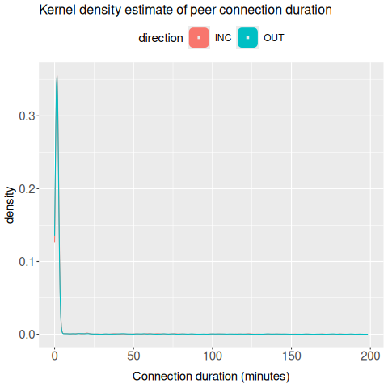</td>
<td>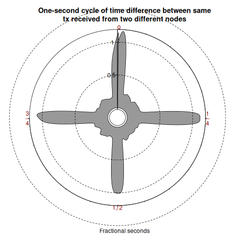</td>
<td>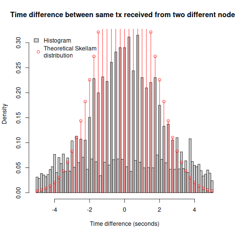</td>
</tr>
<tr>
<td><b>15% reachable + 5 supernodes</b> (sn_r15, 150 min)</td>
<td>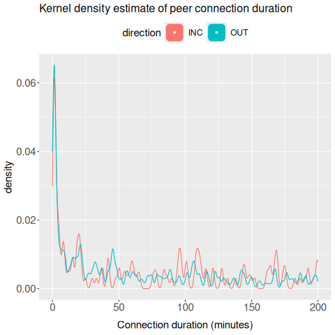</td>
<td>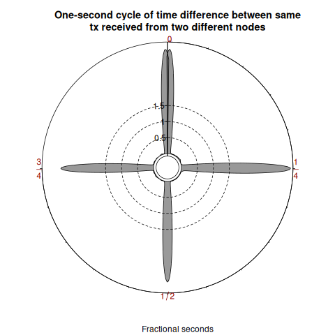</td>
<td>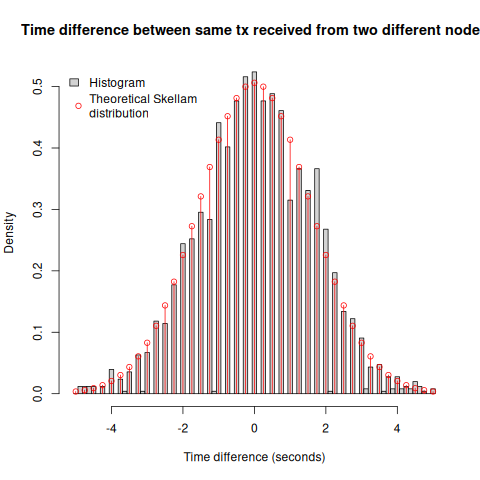</td>
</tr>
<tr>
<td>Reachable-fraction sweep (40 / 60 / 80%)</td>
<td colspan="3" align="center"><i>— sweep in progress; figures + the fraction that lands at ~23 min will be added here —</i></td>
</tr>
</table>

## 6. Caveats / open questions

1. **Window-sensitivity:** the tx-gap metric accumulates recurrence over the
   observation window, so matching the *absolute* 23 min requires a window
   comparable to Rucknium's. A static reachable fraction may not produce a
   window-independent 23 min — peer **turnover (churn)** is the mechanism that
   bounds recurrence on real mainnet, and is the natural next lever after the
   fraction sweep.
2. **Throughput-throttle cause** (§4) is unresolved.
3. **Supernode model:** regular reachable nodes use the default *unlimited*
   inbound, so they too become high-degree; the supernodes' distinction here is
   mainly out-degree. A sharper hub model would cap regular-node inbound.

## 7. Reproduction

- Feature + configs: `--reachable` (commit `cbd36f19`);
  `test_configs/topo1k_supernodes.{scenario.,}yaml` (supernode mix),
  `test_configs/clumping_0p67_monitor.yaml` (all-reachable control).
- Run: `./run_sim.sh --config test_configs/topo1k_supernodes.yaml --name <n> --reachable <f>`
- Analyze: `analysis/ruck_analysis.r` (tx-gap conn-duration + clumping);
  `analysis/results_clumping_0p67/conn_gossip_join.py` (TCP-level join, needs
  log-level 1).
- Archives: `archived_runs/20260619_135809_sn_r15/` (the new run);
  `archived_runs/20260610_031558_clumping_0p67_monitor/` and the v2 response doc
  for the all-reachable baselines. (The excluded `topo1k_r15` partial is not a
  data source.)
