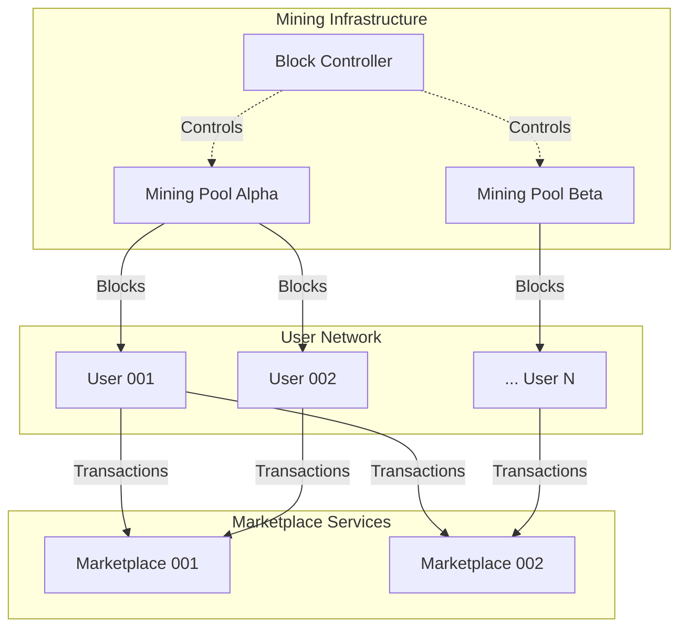
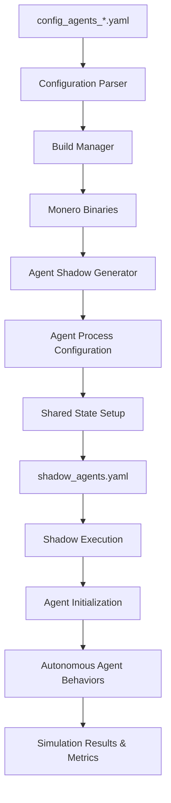
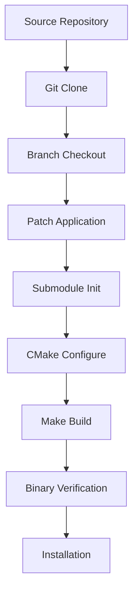

# MoneroSim Architecture

This document provides a comprehensive technical overview of MoneroSim's architecture, design decisions, and internal workings.

## Overview

MoneroSim is a discrete-event network simulation framework built specifically for analyzing Monero cryptocurrency networks at scale. It bridges the gap between the Monero cryptocurrency daemon and the Shadow discrete-event network simulator, enabling researchers to study network behavior, consensus mechanisms, and performance characteristics in controlled environments.

MoneroSim now supports only agent-based simulation mode:
1. **Agent-Based Mode**: Scalable, realistic network simulation with autonomous participants

## Core Architecture

### Component Overview

```
┌─────────────────────────────────────────────────────────────┐
│                     MoneroSim                              │
├─────────────────────────────────────────────────────────────┤
│  CLI Interface (main.rs)                                   │
│  ├── Configuration Parser (config.rs)                     │
│  ├── Build Manager (build.rs)                             │
│  └── Agent Shadow Generator (shadow_agents.rs)            │
├─────────────────────────────────────────────────────────────┤
│  Agent Framework (Python)                                  │
│  ├── Base Agent (base_agent.py)                          │
│  ├── Regular User Agent (regular_user.py)                │
│  ├── Marketplace Agent (marketplace.py)                   │
│  ├── Mining Pool Agent (mining_pool.py)                  │
│  ├── Block Controller Agent (block_controller.py)        │
│  └── Monero RPC Client (monero_rpc.py)                   │
├─────────────────────────────────────────────────────────────┤
│  Testing & Monitoring Scripts (Python)                     │
│  ├── Core Scripts (simple_test.py, sync_check.py, etc.)  │
│  ├── Error Handling Module (error_handling.py)           │
│  ├── Network Configuration (network_config.py)           │
│  └── Test Suite (95%+ coverage)                          │
├─────────────────────────────────────────────────────────────┤
│  Shadow Network Simulator                                  │
│  ├── Discrete Event Engine                                │
│  ├── Virtual Network Stack                                │
│  └── Process Management                                    │
├─────────────────────────────────────────────────────────────┤
│  Modified Monero Nodes                                     │
│  ├── Shadow Compatibility Layer                           │
│  ├── P2P Networking                                       │
│  ├── Consensus Engine                                     │
│  └── Blockchain State                                     │
└─────────────────────────────────────────────────────────────┘
```

### Key Components

#### 1. Configuration Management (`src/config.rs`)

**Purpose**: Parses and validates YAML configuration files, transforming user-friendly parameters into internal data structures.

**Key Features**:
- YAML parsing with comprehensive error handling
- Configuration validation and sanitization
- Support for human-readable time formats ("10m", "1h", "30s")
- Multiple node type configurations
- Patch and build customization options
- Support for agent-based configurations

**Data Structures**:
```rust
pub struct Config {
    pub general: GeneralConfig,
    pub monero: MoneroConfig,
}

pub struct MoneroConfig {
    pub nodes: Vec<NodeType>,
}

pub struct NodeType {
    pub count: u32,
    pub name: String,
    pub base_commit: Option<String>,
    pub patches: Option<Vec<String>>,
    pub prs: Option<Vec<u32>>,
}
```

#### 2. Build Management (`src/build.rs`)

**Purpose**: Manages the complex process of building multiple Monero variants with different patches, commits, and modifications.

**Key Responsibilities**:
- Clone and manage multiple Monero source trees
- Apply Shadow compatibility patches
- Handle git operations (checkout, patch application, submodule management)
- Build Monero binaries with Shadow-specific flags
- Manage build artifacts and binary locations

**Build Process**:
1. **Source Preparation**: Clone from `../monero-shadow` repository
2. **Branch Management**: Checkout specific commits/branches (e.g., `shadow-complete`)
3. **Patch Application**: Apply any additional patches specified in configuration
4. **Submodule Initialization**: Ensure all git submodules are properly initialized
5. **CMake Configuration**: Configure build with `-DSHADOW_BUILD=ON` flag
6. **Compilation**: Multi-threaded build using available CPU cores
7. **Binary Location**: Track and verify successful binary creation

**Build Artifacts**:
```
builds/
├── A/                          # Node type A build
│   └── monero/
│       ├── bin/monerod        # Built binary (preferred location)
│       └── build/Linux/.../bin/monerod  # Alternative location
└── B/                          # Node type B build (if configured)
    └── monero/
        └── ...
```

#### 3. Shadow Configuration Generation

##### Agent-Based Mode (`src/shadow_agents.rs`)

**Purpose**: Generates Shadow configurations for complex, realistic network simulations with autonomous agents.

**Key Features**:
- Support for multiple participant types (users, marketplaces, mining pools)
- Scalable configurations (small: 2-10, medium: 10-50, large: 50-100+ participants)
- Automatic agent process configuration
- Shared state directory setup
- Coordinated startup sequencing

**Agent Network Topology**:


**IP Allocation**:
- Network range: `11.0.0.0/8`
- Node assignment: `11.0.0.{node_index + 1}`
- Port allocation: `28080 + node_index` for P2P
- RPC ports: `18080 + node_index`
- Wallet RPC ports: `38080 + wallet_index`

#### 4. Agent Framework (`agents/`)

The agent framework provides a sophisticated simulation environment where different types of network participants interact autonomously.

##### Base Agent (`agents/base_agent.py`)
- Abstract base class for all agent types
- Provides lifecycle management (setup, run, cleanup)
- Handles RPC connections to Monero nodes and wallets
- Implements shared state management for inter-agent communication
- Includes signal handling and graceful shutdown

##### Regular User Agent (`agents/regular_user.py`)
- Simulates typical Monero users
- Maintains personal wallets
- Sends transactions to marketplaces based on configurable patterns
- Monitors transaction confirmations
- Configurable transaction frequency and amounts

##### Marketplace Agent (`agents/marketplace.py`)
- Represents services that receive payments
- Tracks incoming transactions
- Maintains transaction history
- Publishes receiving addresses for users

##### Mining Pool Agent (`agents/mining_pool.py`)
- Participates in coordinated mining
- Responds to mining control signals
- Tracks mining statistics and blocks found
- Supports configurable mining threads

##### Block Controller Agent (`agents/block_controller.py`)
- Orchestrates mining across multiple pools
- Ensures consistent block generation
- Implements round-robin pool selection
- Monitors blockchain progress

##### Monero RPC Client (`agents/monero_rpc.py`)
- Provides clean Python interface to Monero RPC APIs
- Supports both daemon and wallet RPC methods
- Includes retry logic and error handling
- Used by all agents for blockchain interaction

#### 5. Testing and Monitoring Scripts (Python)

All testing and monitoring scripts have been migrated from Bash to Python, providing improved reliability, better error handling, and 95%+ test coverage.

##### Core Scripts
- **`scripts/simple_test.py`**: Basic mining and synchronization test
- **`scripts/sync_check.py`**: Verifies network synchronization
- **`scripts/block_controller.py`**: Controls block generation
- **`scripts/monitor.py`**: Monitors simulation status
- **`scripts/transaction_script.py`**: Enhanced transaction handling
- **`scripts/test_p2p_connectivity.py`**: P2P connection verification

##### Supporting Modules
- **`scripts/error_handling.py`**: Provides error handling and logging utilities
  - Colored logging output
  - Retry mechanisms for RPC calls
  - Graceful error recovery
  - Consistent error reporting

- **`scripts/network_config.py`**: Centralizes network configuration
  - Node IP and port management
  - Wallet configuration
  - Network topology information
  - Configuration validation

##### Test Suite
- **`scripts/run_all_tests.py`**: Comprehensive test runner
- 50+ unit tests covering all functionality
- 95%+ code coverage achieved
- HTML coverage reports available
- Continuous integration ready

##### Legacy Scripts (Deprecated)
All Bash scripts have been moved to `legacy_scripts/` and are retained only for historical reference:
- `legacy_scripts/simple_test.sh`
- `legacy_scripts/sync_check.sh`
- `legacy_scripts/block_controller.sh`
- `legacy_scripts/monitor_script.sh`
- `legacy_scripts/error_handling.sh`
- `legacy_scripts/network_config.sh`

#### 6. CLI Interface (`src/main.rs`)

**Purpose**: Provides the command-line interface and orchestrates the entire simulation generation process.

**Command Structure**:
```bash
# Agent-based mode
monerosim --config <config_agents_small.yaml> --output <output_dir>
```

**Execution Flow**:
1. Parse command-line arguments
2. Load and validate configuration
3. Prepare build plans for each node type
4. Build Monero binaries (if needed)
5. Generate appropriate Shadow configuration
6. Output final configuration and usage instructions

## Agent Communication Architecture

The agent framework uses a shared state mechanism for coordination:

```
/tmp/monerosim_shared/
├── users.json                    # List of all user agents
├── marketplaces.json            # List of all marketplace agents
├── mining_pools.json            # List of all mining pools
├── block_controller.json        # Block controller status
├── transactions.json            # Transaction log
├── blocks_found.json           # Block discovery log
├── marketplace_payments.json    # Payment tracking
├── mining_signals/             # Mining control signals
│   ├── poolalpha.json
│   └── poolbeta.json
└── [agent]_stats.json          # Per-agent statistics
```

This architecture enables:
- **Decentralized coordination**: No central control point
- **Fault tolerance**: Agents can recover from failures
- **Observability**: All actions are logged and traceable
- **Flexibility**: Easy to add new agent types

## Shadow Integration

### Why Shadow?

Shadow is a discrete-event network simulator that provides several key advantages for cryptocurrency network research:

1. **Deterministic Execution**: Reproducible results for scientific analysis
2. **Scalability**: Can simulate thousands of nodes on modest hardware
3. **Network Control**: Complete control over network conditions, latency, bandwidth
4. **Resource Efficiency**: Shares memory and CPU resources across simulated nodes
5. **Real Code Execution**: Runs actual Monero binaries, not simplified models

### Shadow Compatibility Modifications

MoneroSim includes several modifications to make Monero compatible with Shadow:

#### 1. Build System Integration
- CMake flag: `-DSHADOW_BUILD=ON`
- Conditional compilation for Shadow-specific code paths
- Optimized resource usage for simulation environment

#### 2. Network Stack Modifications
- Shadow network API integration
- P2P timeout adjustments for discrete-event simulation
- Connection handling optimizations

#### 3. Seed Node Disabling
- `--disable-seed-nodes` flag implementation
- Prevents connections to real Monero network during simulation
- Forces exclusive use of simulated network topology

#### 4. Consensus Modifications (Testnet from Scratch)
- Accelerated hard fork schedule for testing
- All hard forks activated at low block heights (10, 20, 30, ...)
- Enables immediate access to latest Monero features

## Data Flow


### Agent-Based Mode Configuration to Execution



### Build Process Detail



## Design Decisions

### 1. Rust Implementation

**Rationale**: Rust provides memory safety, performance, and excellent error handling which are crucial for a system that manages complex build processes and generates critical configuration files.

**Benefits**:
- Zero-cost abstractions for performance
- Strong type system prevents configuration errors
- Excellent ecosystem for YAML parsing, CLI tools, and process management
- Memory safety eliminates entire classes of bugs

### 2. YAML Configuration

**Rationale**: YAML provides human-readable configuration with good tooling support and validation capabilities.

**Advantages**:
- Human-readable and editable
- Strong schema validation support
- Hierarchical structure matches simulation complexity
- Good integration with Rust ecosystem

### 3. Python for Testing and Agents

**Rationale**: Python was chosen for the testing infrastructure and agent framework for its rapid development capabilities and excellent library support.

**Benefits**:
- Rapid prototyping and iteration
- Excellent RPC library support
- Easy integration with analysis tools
- Good async/concurrent programming support
- Accessible for researchers to modify
- Better error handling than shell scripts
- Cross-platform compatibility

### 4. Git-based Patch Management

**Rationale**: Using git branches and patches provides version control, reproducibility, and easy maintenance of Monero modifications.

**Benefits**:
- Full version control of modifications
- Easy rollback and testing of changes
- Collaborative development support
- Integration with existing Monero development workflow

### 5. Shadow Compatibility Layer

**Rationale**: Rather than creating a simplified Monero model, MoneroSim runs actual Monero code with minimal modifications for maximum fidelity.

**Advantages**:
- High fidelity simulation results
- Easier maintenance as Monero evolves
- Real-world applicable insights
- Reduced development complexity

### 6. Shared State Architecture for Agents

**Rationale**: A file-based shared state mechanism provides simple, robust coordination between agents without requiring a central coordinator.

**Benefits**:
- Decentralized design
- Easy debugging (human-readable JSON files)
- Fault tolerance
- Simple to extend

## Performance Characteristics


### Agent-Based Mode Scalability

- **Small scale** (2-10 agents): Minimal resource usage, near real-time
- **Medium scale** (10-50 agents): Moderate resource usage, realistic dynamics
- **Large scale** (50-100+ agents): Higher requirements, complex behaviors

### Resource Usage

- **Memory**: ~100-500MB per simulated node
- **CPU**: Scales with simulation complexity and host CPU count
- **Disk**: ~1-10MB per node per simulation hour for logs
- **Network**: Simulated, no real network traffic

### Optimization Strategies

1. **Multi-core utilization**: Shadow parallelizes discrete events
2. **Memory sharing**: Common binaries and libraries shared across nodes
3. **Event batching**: Reduces simulation overhead
4. **Selective logging**: Configurable log levels to reduce I/O
5. **Staggered agent startup**: Prevents resource contention
6. **Efficient RPC usage**: Connection pooling and retry logic

## Python Infrastructure

### Virtual Environment

- **Location**: `/home/lever65/monerosim_dev/monerosim/venv`
- **Python Version**: 3.6+ (3.8+ recommended)
- **Dependencies**: Managed via `scripts/requirements.txt`

### Testing Infrastructure

- **Test Runner**: `scripts/run_all_tests.py`
- **Coverage**: 95%+ achieved with detailed HTML reports
- **Unit Tests**: 50+ tests covering all functionality
- **Integration Tests**: Verified in production simulations

### Error Handling

The Python infrastructure includes sophisticated error handling:
- Colored logging for better visibility
- Retry mechanisms for transient failures
- Graceful degradation
- Comprehensive error reporting

## Extensibility

### Adding New Node Types

1. Define new `NodeType` in configuration
2. Specify appropriate `base_commit` and `patches`
3. MoneroSim automatically handles build and integration

### Adding New Agent Types

1. Create new agent class inheriting from `BaseAgent`
2. Implement required methods (`setup`, `run`, `cleanup`)
3. Add agent type to configuration
4. Update shared state structure if needed

### Custom Network Topologies

Modify `src/shadow_agents.rs` to implement alternative connection patterns:
- Mesh networks
- Ring topologies
- Random graphs
- Real-world network topologies

### Additional Cryptocurrency Support

The architecture is designed to be extensible to other cryptocurrencies:
1. Implement new build management for target cryptocurrency
2. Add appropriate Shadow compatibility modifications
3. Update configuration schema
4. Implement topology generation for new P2P protocols

## Security Considerations

### Simulation Environment

- **Isolated execution**: Shadow simulations are completely isolated from real networks
- **No real transactions**: All blockchain activity is simulated
- **No real keys**: Can safely use test keys and addresses

### Build Security

- **Source verification**: Git commit verification for reproducible builds
- **Patch auditing**: All modifications are version-controlled and auditable
- **Dependency management**: Cargo.lock ensures reproducible dependencies

## Future Enhancements

### Planned Features

1. **WebUI**: Browser-based configuration and result visualization
2. **Advanced topologies**: Geographic distribution simulation
3. **Performance profiling**: Built-in performance analysis tools
4. **Multi-version testing**: Automated testing across Monero versions
5. **Cloud deployment**: Support for cloud-based simulation execution
6. **Enhanced agent behaviors**: More sophisticated trading patterns
7. **Attack simulations**: Network attack and defense scenarios

### Research Applications

- **Network analysis**: P2P protocol performance and security
- **Consensus research**: Hard fork behavior and network splits
- **Performance optimization**: Bottleneck identification and resolution
- **Attack simulation**: Eclipse attacks, Sybil attacks, network partitions
- **Scalability analysis**: Performance with varying network sizes
- **Economic modeling**: Market dynamics and fee markets
- **Privacy analysis**: Transaction linkability and anonymity sets