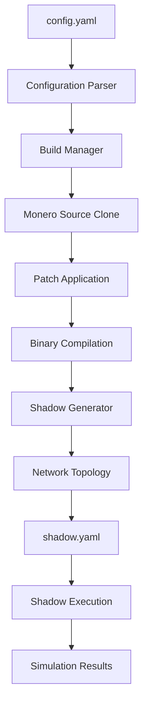
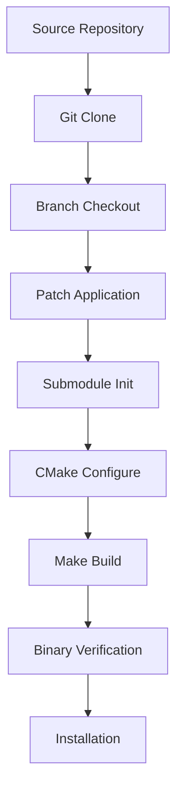

# MoneroSim Architecture

This document provides a comprehensive technical overview of MoneroSim's architecture, design decisions, and internal workings.

## Overview

MoneroSim is a discrete-event network simulation framework built specifically for analyzing Monero cryptocurrency networks at scale. It bridges the gap between the Monero cryptocurrency daemon and the Shadow discrete-event network simulator, enabling researchers to study network behavior, consensus mechanisms, and performance characteristics in controlled environments.

## Core Architecture

### Component Overview

```
┌─────────────────────────────────────────────────────────────┐
│                     MoneroSim                              │
├─────────────────────────────────────────────────────────────┤
│  CLI Interface (main.rs)                                   │
│  ├── Configuration Parser (config.rs)                     │
│  ├── Build Manager (build.rs)                             │
│  └── Shadow Generator (shadow.rs)                         │
├─────────────────────────────────────────────────────────────┤
│  Shadow Network Simulator                                  │
│  ├── Discrete Event Engine                                │
│  ├── Virtual Network Stack                                │
│  └── Process Management                                    │
├─────────────────────────────────────────────────────────────┤
│  Modified Monero Nodes                                     │
│  ├── Shadow Compatibility Layer                           │
│  ├── P2P Networking                                       │
│  ├── Consensus Engine                                     │
│  └── Blockchain State                                     │
└─────────────────────────────────────────────────────────────┘
```

### Key Components

#### 1. Configuration Management (`src/config.rs`)

**Purpose**: Parses and validates YAML configuration files, transforming user-friendly parameters into internal data structures.

**Key Features**:
- YAML parsing with comprehensive error handling
- Configuration validation and sanitization
- Support for human-readable time formats ("10m", "1h", "30s")
- Multiple node type configurations
- Patch and build customization options

**Data Structures**:
```rust
pub struct Config {
    pub general: GeneralConfig,
    pub monero: MoneroConfig,
}

pub struct MoneroConfig {
    pub nodes: Vec<NodeType>,
}

pub struct NodeType {
    pub count: u32,
    pub name: String,
    pub base_commit: Option<String>,
    pub patches: Option<Vec<String>>,
    pub prs: Option<Vec<u32>>,
}
```

#### 2. Build Management (`src/build.rs`)

**Purpose**: Manages the complex process of building multiple Monero variants with different patches, commits, and modifications.

**Key Responsibilities**:
- Clone and manage multiple Monero source trees
- Apply Shadow compatibility patches
- Handle git operations (checkout, patch application, submodule management)
- Build Monero binaries with Shadow-specific flags
- Manage build artifacts and binary locations

**Build Process**:
1. **Source Preparation**: Clone from `../monero-shadow` repository
2. **Branch Management**: Checkout specific commits/branches (e.g., `shadow-complete`)
3. **Patch Application**: Apply any additional patches specified in configuration
4. **Submodule Initialization**: Ensure all git submodules are properly initialized
5. **CMake Configuration**: Configure build with `-DSHADOW_BUILD=ON` flag
6. **Compilation**: Multi-threaded build using available CPU cores
7. **Binary Location**: Track and verify successful binary creation

**Build Artifacts**:
```
builds/
├── A/                          # Node type A build
│   └── monero/
│       ├── bin/monerod        # Built binary (preferred location)
│       └── build/Linux/.../bin/monerod  # Alternative location
└── B/                          # Node type B build (if configured)
    └── monero/
        └── ...
```

#### 3. Shadow Configuration Generation (`src/shadow.rs`)

**Purpose**: Generates Shadow simulator configuration files that define the network topology, node configurations, and simulation parameters.

**Key Features**:
- Network topology generation (star, mesh, custom patterns)
- IP address allocation and management
- Port assignment and P2P connection mapping
- Environment variable configuration for Monero nodes
- EthShadow-style configuration compatibility

**Network Topology**:
The current implementation uses a **star topology with sequential connections**:
- Node `a0` acts as a bootstrap node
- Each subsequent node connects to `a0` and the previous node
- This provides redundancy while maintaining connectivity

**IP Allocation**:
- Network range: `11.0.0.0/8`
- Node assignment: `11.0.0.{node_index + 1}`
- Port allocation: `28080 + node_index` for P2P
- RPC ports: `18080 + node_index`

**Configuration Structure**:
```yaml
general:
  stop_time: "10m"
  model_unblocked_syscall_latency: true

network:
  graph:
    type: gml
    inline: |
      graph [
        node [id 0 host_bandwidth_down="1 Gbit" host_bandwidth_up="1 Gbit"]
        # ... additional nodes
      ]

hosts:
  a0:
    network_node_id: 0
    processes:
    - path: monerod
      args: [--testnet, --disable-seed-nodes, ...]
      environment:
        RUST_LOG: "info"
      expected_final_state: running
```

#### 4. CLI Interface (`src/main.rs`)

**Purpose**: Provides the command-line interface and orchestrates the entire simulation generation process.

**Command Structure**:
```bash
monerosim --config <config.yaml> --output <output_dir>
```

**Execution Flow**:
1. Parse command-line arguments
2. Load and validate configuration
3. Prepare build plans for each node type
4. Build Monero binaries (if needed)
5. Generate Shadow configuration
6. Output final configuration and usage instructions

## Shadow Integration

### Why Shadow?

Shadow is a discrete-event network simulator that provides several key advantages for cryptocurrency network research:

1. **Deterministic Execution**: Reproducible results for scientific analysis
2. **Scalability**: Can simulate thousands of nodes on modest hardware
3. **Network Control**: Complete control over network conditions, latency, bandwidth
4. **Resource Efficiency**: Shares memory and CPU resources across simulated nodes
5. **Real Code Execution**: Runs actual Monero binaries, not simplified models

### Shadow Compatibility Modifications

MoneroSim includes several modifications to make Monero compatible with Shadow:

#### 1. Build System Integration
- CMake flag: `-DSHADOW_BUILD=ON`
- Conditional compilation for Shadow-specific code paths
- Optimized resource usage for simulation environment

#### 2. Network Stack Modifications
- Shadow network API integration
- P2P timeout adjustments for discrete-event simulation
- Connection handling optimizations

#### 3. Seed Node Disabling
- `--disable-seed-nodes` flag implementation
- Prevents connections to real Monero network during simulation
- Forces exclusive use of simulated network topology

#### 4. Consensus Modifications (Testnet from Scratch)
- Accelerated hard fork schedule for testing
- All hard forks activated at low block heights (10, 20, 30, ...)
- Enables immediate access to latest Monero features

## Data Flow

### Configuration to Execution



### Build Process Detail



## Design Decisions

### 1. Rust Implementation

**Rationale**: Rust provides memory safety, performance, and excellent error handling which are crucial for a system that manages complex build processes and generates critical configuration files.

**Benefits**:
- Zero-cost abstractions for performance
- Strong type system prevents configuration errors
- Excellent ecosystem for YAML parsing, CLI tools, and process management
- Memory safety eliminates entire classes of bugs

### 2. YAML Configuration

**Rationale**: YAML provides human-readable configuration with good tooling support and validation capabilities.

**Advantages**:
- Human-readable and editable
- Strong schema validation support
- Hierarchical structure matches simulation complexity
- Good integration with Rust ecosystem

### 3. Git-based Patch Management

**Rationale**: Using git branches and patches provides version control, reproducibility, and easy maintenance of Monero modifications.

**Benefits**:
- Full version control of modifications
- Easy rollback and testing of changes
- Collaborative development support
- Integration with existing Monero development workflow

### 4. Shadow Compatibility Layer

**Rationale**: Rather than creating a simplified Monero model, MoneroSim runs actual Monero code with minimal modifications for maximum fidelity.

**Advantages**:
- High fidelity simulation results
- Easier maintenance as Monero evolves
- Real-world applicable insights
- Reduced development complexity

## Performance Characteristics

### Scalability

- **Small simulations** (1-10 nodes): Near real-time execution
- **Medium simulations** (10-50 nodes): 2-5x faster than real-time
- **Large simulations** (50+ nodes): Dependent on host resources

### Resource Usage

- **Memory**: ~100-500MB per simulated node
- **CPU**: Scales with simulation complexity and host CPU count
- **Disk**: ~1-10MB per node per simulation hour for logs
- **Network**: Simulated, no real network traffic

### Optimization Strategies

1. **Multi-core utilization**: Shadow parallelizes discrete events
2. **Memory sharing**: Common binaries and libraries shared across nodes
3. **Event batching**: Reduces simulation overhead
4. **Selective logging**: Configurable log levels to reduce I/O

## Extensibility

### Adding New Node Types

1. Define new `NodeType` in configuration
2. Specify appropriate `base_commit` and `patches`
3. MoneroSim automatically handles build and integration

### Custom Network Topologies

Modify `src/shadow.rs` to implement alternative connection patterns:
- Mesh networks
- Ring topologies
- Random graphs
- Real-world network topologies

### Additional Cryptocurrency Support

The architecture is designed to be extensible to other cryptocurrencies:
1. Implement new build management for target cryptocurrency
2. Add appropriate Shadow compatibility modifications
3. Update configuration schema
4. Implement topology generation for new P2P protocols

## Security Considerations

### Simulation Environment

- **Isolated execution**: Shadow simulations are completely isolated from real networks
- **No real transactions**: All blockchain activity is simulated
- **No real keys**: Can safely use test keys and addresses

### Build Security

- **Source verification**: Git commit verification for reproducible builds
- **Patch auditing**: All modifications are version-controlled and auditable
- **Dependency management**: Cargo.lock ensures reproducible dependencies

## Future Enhancements

### Planned Features

1. **WebUI**: Browser-based configuration and result visualization
2. **Advanced topologies**: Geographic distribution simulation
3. **Performance profiling**: Built-in performance analysis tools
4. **Multi-version testing**: Automated testing across Monero versions
5. **Cloud deployment**: Support for cloud-based simulation execution

### Research Applications

- **Network analysis**: P2P protocol performance and security
- **Consensus research**: Hard fork behavior and network splits
- **Performance optimization**: Bottleneck identification and resolution
- **Attack simulation**: Eclipse attacks, Sybil attacks, network partitions
- **Scalability analysis**: Performance with varying network sizes 