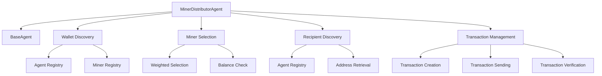

# Miner Distributor Agent Design Document

## Overview

The Miner Distributor Agent is a specialized agent for Monerosim that distributes Monero from miner wallets to other participants in the network. It discovers available miners, selects one based on configurable criteria, and uses its wallet to send transactions to other agents.

## Architecture



## Key Components

### 1. Wallet Discovery Mechanism
- Read from the agent registry to find all miners
- Check miner registry for additional information (hashrate, weights)
- Verify wallet availability and balance through RPC calls

### 2. Miner Selection Strategy
- **Weighted Selection**: Select miners based on their hashrate weights
- **Balance-based Selection**: Prefer miners with higher balances
- **Random Selection**: Choose a miner at random (fallback option)

### 3. Recipient Discovery Mechanism
- Read from the agent registry to find all agents with wallets
- Exclude the selected miner from potential recipients
- Retrieve wallet addresses via RPC calls
- Support both random and round-robin selection strategies

### 4. Transaction Management
- Create transactions with configurable amounts
- Handle transaction fees and priority
- Implement retry logic for failed transactions
- Record transaction history in shared state

## Configuration Options

The agent will support the following configuration options in the YAML file:

```yaml
attributes:
  transaction_frequency: "60"  # Seconds between transactions
  min_transaction_amount: "0.1"  # Minimum XMR per transaction
  max_transaction_amount: "1.0"  # Maximum XMR per transaction
  miner_selection_strategy: "weighted"  # weighted, balance, random
  transaction_priority: "1"  # Transaction priority (0-3)
  max_retries: "3"  # Maximum retry attempts for failed transactions
  recipient_selection: "random"  # random, round_robin
```

## Implementation Details

### Class Structure

```python
class MinerDistributorAgent(BaseAgent):
    """
    Agent that distributes Monero from miner wallets to other agents.
    
    This agent:
    1. Discovers available miners from the agent registry
    2. Selects a miner wallet based on configurable strategy
    3. Distributes Monero to other agents in the network
    4. Records transaction history in shared state
    """
    
    def __init__(self, agent_id: str, **kwargs):
        super().__init__(agent_id=agent_id, **kwargs)
        # Initialize transaction-specific parameters
        self.min_transaction_amount = 0.1
        self.max_transaction_amount = 1.0
        self.transaction_frequency = 60
        self.miner_selection_strategy = "weighted"
        self.transaction_priority = 1
        self.max_retries = 3
        self.recipient_selection = "random"
        
        # Runtime state
        self.miners = []
        self.selected_miner = None
        self.last_transaction_time = 0
        self.recipient_index = 0
    
    def _setup_agent(self):
        """Initialize the miner distributor agent"""
        # Parse configuration attributes
        self._parse_configuration()
        
        # Discover available miners
        self._discover_miners()
        
        # Register in agent registry
        self._register_as_miner_distributor_agent()
    
    def run_iteration(self) -> float:
        """Single iteration of Monero distribution behavior"""
        current_time = time.time()
        
        # Check if it's time to send a transaction
        if current_time - self.last_transaction_time >= self.transaction_frequency:
            try:
                # Select a miner wallet
                miner = self._select_miner()
                if not miner:
                    self.logger.warning("No suitable miner found, will retry later")
                    return 30.0
                
                # Select a recipient
                recipient = self._select_recipient()
                if not recipient:
                    self.logger.warning("No suitable recipient found, will retry later")
                    return 30.0
                
                # Send transaction
                success = self._send_transaction(miner, recipient)
                if success:
                    self.last_transaction_time = current_time
                
                # Return time until next transaction
                return self.transaction_frequency
                
            except Exception as e:
                self.logger.error(f"Error in transaction iteration: {e}")
                return 30.0
        
        # Calculate time until next transaction
        return self.transaction_frequency - (current_time - self.last_transaction_time)
```

### Key Methods

#### Wallet Discovery

```python
def _discover_miners(self):
    """
    Discover available miners from agent and miner registries.
    Updates self.miners with discovered miner information.
    """
    # Read agent registry
    agent_registry = self.read_shared_state("agent_registry.json")
    if not agent_registry:
        self.logger.warning("Agent registry not found")
        return
    
    # Read miner registry
    miner_registry = self.read_shared_state("miners.json")
    if not miner_registry:
        self.logger.warning("Miner registry not found")
        return
    
    # Combine information from both registries
    self.miners = []
    for agent in agent_registry.get("agents", []):
        # Check if this agent is a miner
        if agent.get("attributes", {}).get("is_miner") == "true":
            # Find corresponding miner in miner registry
            miner_info = None
            for miner in miner_registry.get("miners", []):
                if miner.get("ip_addr") == agent.get("ip_addr"):
                    miner_info = miner
                    break
            
            if miner_info:
                # Combine agent and miner information
                combined_miner = {
                    "agent_id": agent.get("id"),
                    "ip_addr": agent.get("ip_addr"),
                    "wallet_rpc_port": agent.get("wallet_rpc_port"),
                    "wallet_address": miner_info.get("wallet_address"),
                    "weight": miner_info.get("weight", 0)
                }
                self.miners.append(combined_miner)
    
    self.logger.info(f"Discovered {len(self.miners)} miners")
```

#### Miner Selection

```python
def _select_miner(self) -> Optional[Dict[str, Any]]:
    """
    Select a miner based on the configured strategy.
    
    Returns:
        Selected miner information or None if no suitable miner found
    """
    if not self.miners:
        self.logger.warning("No miners available for selection")
        return None
    
    # Filter miners that have wallet addresses
    available_miners = [m for m in self.miners if m.get("wallet_address")]
    if not available_miners:
        self.logger.warning("No miners with wallet addresses available")
        return None
    
    # Apply selection strategy
    if self.miner_selection_strategy == "weighted":
        return self._select_miner_by_weight(available_miners)
    elif self.miner_selection_strategy == "balance":
        return self._select_miner_by_balance(available_miners)
    else:  # random
        return random.choice(available_miners)

def _select_miner_by_weight(self, miners: List[Dict[str, Any]]) -> Optional[Dict[str, Any]]:
    """Select a miner based on hashrate weight"""
    # Extract weights
    weights = [miner.get("weight", 0) for miner in miners]
    total_weight = sum(weights)
    
    if total_weight == 0:
        self.logger.warning("Total weight is zero, falling back to random selection")
        return random.choice(miners)
    
    # Use numpy if available, otherwise use fallback
    if NUMPY_AVAILABLE:
        import numpy as np
        normalized_weights = np.array(weights, dtype=float) / total_weight
        winner_index = np.random.choice(len(miners), p=normalized_weights)
    else:
        # Fallback implementation
        cumulative_weights = []
        cumulative_sum = 0
        for weight in weights:
            cumulative_sum += weight
            cumulative_weights.append(cumulative_sum)
        
        random_value = random.uniform(0, total_weight)
        winner_index = 0
        for i, cumulative_weight in enumerate(cumulative_weights):
            if random_value <= cumulative_weight:
                winner_index = i
                break
    
    winner = miners[winner_index]
    self.logger.info(f"Selected miner {winner.get('agent_id')} with weight {winner.get('weight')}")
    return winner

def _select_miner_by_balance(self, miners: List[Dict[str, Any]]) -> Optional[Dict[str, Any]]:
    """Select a miner with the highest balance"""
    best_miner = None
    highest_balance = 0
    
    for miner in miners:
        try:
            # Connect to wallet RPC
            wallet_rpc = WalletRPC(miner.get("ip_addr"), miner.get("wallet_rpc_port", 28082))
            wallet_rpc.wait_until_ready(max_wait=10)
            
            # Get balance
            balance_info = wallet_rpc.get_balance()
            unlocked_balance = balance_info.get("unlocked_balance", 0)
            
            # Convert to XMR
            balance_xmr = unlocked_balance / 1e12
            
            if balance_xmr > highest_balance:
                highest_balance = balance_xmr
                best_miner = miner
                
        except Exception as e:
            self.logger.warning(f"Failed to get balance for miner {miner.get('agent_id')}: {e}")
            continue
    
    if best_miner:
        self.logger.info(f"Selected miner {best_miner.get('agent_id')} with balance {highest_balance} XMR")
    
    return best_miner
```

#### Recipient Selection

```python
def _select_recipient(self) -> Optional[Dict[str, Any]]:
    """
    Select a recipient for the transaction.
    
    Returns:
        Recipient information or None if no suitable recipient found
    """
    # Read agent registry to find all agents with wallets
    agent_registry = self.read_shared_state("agent_registry.json")
    if not agent_registry:
        self.logger.warning("Agent registry not found")
        return None
    
    # Find all agents with wallets that are not the selected miner
    potential_recipients = []
    for agent in agent_registry.get("agents", []):
        # Skip if this is the selected miner
        if agent.get("id") == self.selected_miner.get("agent_id"):
            continue
        
        # Only consider agents with wallets
        if agent.get("wallet_rpc_port"):
            potential_recipients.append(agent)
    
    if not potential_recipients:
        self.logger.warning("No potential recipients found")
        return None
    
    # Apply recipient selection strategy
    if self.recipient_selection == "round_robin":
        # Round-robin selection
        recipient = potential_recipients[self.recipient_index % len(potential_recipients)]
        self.recipient_index += 1
        return recipient
    else:  # random
        # Random selection
        return random.choice(potential_recipients)

def _get_recipient_address(self, recipient: Dict[str, Any]) -> Optional[str]:
    """
    Get the wallet address for a recipient.
    
    Args:
        recipient: Recipient agent information
        
    Returns:
        Wallet address or None if unable to retrieve
    """
    try:
        # Connect to recipient's wallet RPC
        wallet_rpc = WalletRPC(recipient.get("ip_addr"), recipient.get("wallet_rpc_port", 28082))
        wallet_rpc.wait_until_ready(max_wait=10)
        
        # Get the address
        address_info = wallet_rpc.get_address()
        return address_info.get("address")
        
    except Exception as e:
        self.logger.error(f"Failed to get address for recipient {recipient.get('id')}: {e}")
        return None
```

#### Transaction Sending

```python
def _send_transaction(self, miner: Dict[str, Any], recipient: Dict[str, Any]) -> bool:
    """
    Send a transaction from the selected miner to the recipient.
    
    Args:
        miner: Miner information including wallet details
        recipient: Recipient information including address
        
    Returns:
        True if transaction was sent successfully, False otherwise
    """
    # Generate random transaction amount
    amount = random.uniform(self.min_transaction_amount, self.max_transaction_amount)
    
    # Connect to miner's wallet
    try:
        wallet_rpc = WalletRPC(miner.get("ip_addr"), miner.get("wallet_rpc_port", 28082))
        wallet_rpc.wait_until_ready(max_wait=10)
        
        # Check balance
        balance_info = wallet_rpc.get_balance()
        unlocked_balance = balance_info.get("unlocked_balance", 0)
        balance_xmr = unlocked_balance / 1e12
        
        if balance_xmr < amount:
            self.logger.warning(f"Insufficient balance: {balance_xmr} XMR < {amount} XMR")
            return False
        
        # Get recipient's wallet address
        recipient_address = self._get_recipient_address(recipient)
        if not recipient_address:
            self.logger.error(f"Failed to get recipient address for {recipient.get('id')}")
            return False
        
        # Prepare transaction
        destinations = [{
            "address": recipient_address,
            "amount": int(amount * 1e12)  # Convert to atomic units
        }]
        
        # Send transaction with retry logic
        for attempt in range(self.max_retries):
            try:
                result = wallet_rpc.transfer(
                    destinations=destinations,
                    priority=self.transaction_priority
                )
                
                if result.get("tx_hash"):
                    # Record successful transaction
                    self._record_transaction(
                        tx_hash=result.get("tx_hash"),
                        sender_id=miner.get("agent_id"),
                        recipient_id=recipient.get("agent_id"),
                        amount=amount
                    )
                    
                    self.logger.info(f"Sent transaction: {result.get('tx_hash')} "
                                  f"from {miner.get('agent_id')} to {recipient.get('agent_id')} "
                                  f"for {amount} XMR")
                    return True
                
            except Exception as e:
                self.logger.warning(f"Transaction attempt {attempt + 1} failed: {e}")
                if attempt < self.max_retries - 1:
                    time.sleep(2 ** attempt)  # Exponential backoff
        
        self.logger.error(f"Failed to send transaction after {self.max_retries} attempts")
        return False
        
    except Exception as e:
        self.logger.error(f"Error sending transaction: {e}")
        return False

def _record_transaction(self, tx_hash: str, sender_id: str, recipient_id: str, amount: float):
    """Record transaction in shared state"""
    tx_record = {
        "tx_hash": tx_hash,
        "sender_id": sender_id,
        "recipient_id": recipient_id,
        "amount": amount,
        "timestamp": time.time()
    }
    
    self.append_shared_list("transactions.json", tx_record)
```

## Configuration Example

Here's how to configure the Miner Distributor Agent in a YAML file:

```yaml
general:
  stop_time: "3h"
  fresh_blockchain: true
  log_level: info

network:
  type: "1_gbit_switch"

agents:
  user_agents:
    # Miners
    - daemon: "monerod"
      wallet: "monero-wallet-rpc"
      attributes:
        is_miner: 'true'
        hashrate: "25"
    
    - daemon: "monerod"
      wallet: "monero-wallet-rpc"
      attributes:
        is_miner: 'true'
        hashrate: "25"
    
    # Miner Distributor Agent
    - daemon: "monerod"
      wallet: "monero-wallet-rpc"
      user_script: "agents.miner_distributor"
      attributes:
        transaction_frequency: "60"
        min_transaction_amount: "0.1"
        max_transaction_amount: "1.0"
        miner_selection_strategy: "weighted"
        transaction_priority: "1"
        max_retries: "3"
        recipient_selection: "random"

  block_controller:
    script: "agents.block_controller"
    
  pure_script_agents:
    - script: "scripts.monitor"
    - script: "scripts.sync_check"
```

## Testing Strategy

1. **Unit Tests**: Test individual methods (miner selection, transaction sending)
2. **Integration Tests**: Test with actual Monero nodes in Shadow
3. **Performance Tests**: Measure transaction throughput and success rate

## Future Enhancements

1. **Dynamic Transaction Amounts**: Adjust amounts based on network conditions
2. **Transaction Pool Monitoring**: Monitor mempool and adjust fees accordingly
3. **Multi-signature Transactions**: Support for more complex transaction types
4. **Scheduled Transactions**: Support for time-delayed or recurring transactions