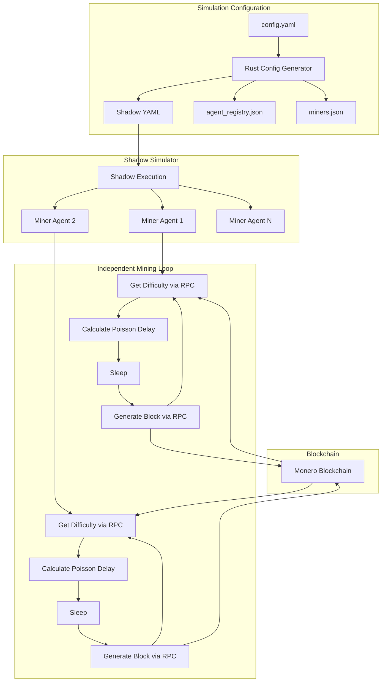

# Technical Specification: Independent Agent-Driven Mining Control for Monerosim

**Version:** 1.0  
**Last Updated:** December 28, 2025  
**Status:** Clean-slate design replacing block_controller

---

## 1.0 Overview and Design Philosophy

This specification defines a **fully decentralized, agent-driven mining architecture** where each mining-enabled agent independently determines when to generate blocks using a Poisson distribution model. This approach eliminates the centralized block controller and creates a more realistic, autonomous mining simulation.

### 1.1 Core Design Principles

1. **Agent Autonomy**: Each miner operates independently without central coordination
2. **Probabilistic Block Discovery**: Uses Poisson distribution for realistic timing
3. **Deterministic Reproducibility**: Global simulation seed ensures identical runs
4. **RPC-Based Operation**: All mining decisions based on direct RPC queries
5. **Zero Coordination Overhead**: No shared state files for mining control
6. **Blockchain as Truth**: The blockchain itself is the sole source of coordination

### 1.2 Key Differences from Block Controller

| Aspect | Block Controller (Old) | Independent Mining (New) |
|--------|------------------------|--------------------------|
| Architecture | Centralized scheduler | Distributed agents |
| Coordination | Shared state files | Blockchain only |
| Block generation | Controller selects winner | Each agent self-determines |
| Timing | Fixed intervals | Poisson distribution |
| Determinism | Controlled timing | Seeded randomness |
| Scalability | Single point of failure | Fully distributed |

---

## 2.0 System Architecture

### 2.1 High-Level Architecture



### 2.2 Component Relationships

**Configuration Layer (Rust)**:
- Parse agent configuration with mining attributes
- Generate `miners.json` registry with hashrate allocations
- Validate hashrate percentages sum to 100%
- Assign mining script to each miner agent

**Agent Layer (Python)**:
- `autonomous_miner.py` - New independent mining agent
- Inherits from `BaseAgent` for lifecycle management
- Self-contained mining loop with Poisson timing
- Direct RPC communication with own monerod

**Blockchain Layer**:
- Single source of truth for network state
- Difficulty updates via RPC
- Block height synchronization
- Mining success propagation

---

## 3.0 Probabilistic Mining Model

### 3.1 Mathematical Foundation

The Poisson distribution models the time between independent random events (block discoveries) with a constant average rate.

**Key Parameters**:
- `λ` (lambda): Success rate = `agent_hashrate / network_difficulty`
- `T`: Time to find block (seconds)
- `U`: Uniform random number [0, 1)

**Formula**:
```
T = -ln(1 - U) / λ
```

**Where**:
- `agent_hashrate` = (hashrate_percentage / 100) × total_network_hashrate
- `total_network_hashrate` = configurable baseline (default: 1,000,000 H/s)
- `network_difficulty` = current difficulty from monerod RPC

### 3.2 Implementation Example

```python
import math
import random

def calculate_block_discovery_time(hashrate_pct, network_difficulty, total_hashrate=1_000_000):
    """
    Calculate time until next block discovery using Poisson distribution.
    
    Args:
        hashrate_pct: Agent's percentage of total network hashrate (0-100)
        network_difficulty: Current network difficulty from RPC
        total_hashrate: Total network hashrate in H/s
        
    Returns:
        Time in seconds until block discovery
    """
    # Calculate agent's effective hashrate
    agent_hashrate = (hashrate_pct / 100.0) * total_hashrate
    
    # Calculate success rate (lambda)
    lambda_rate = agent_hashrate / network_difficulty
    
    # Generate uniform random number
    u = random.random()
    
    # Calculate time using exponential distribution
    time_seconds = -math.log(1.0 - u) / lambda_rate
    
    return time_seconds
```

### 3.3 Deterministic Seeding

To ensure reproducibility across simulation runs:

```python
# Global seed from configuration
GLOBAL_SEED = int(os.getenv('SIMULATION_SEED', '12345'))

# Agent-specific seed offset based on agent ID
agent_id_hash = hash(agent_id)
agent_seed = GLOBAL_SEED + agent_id_hash

# Initialize RNG with agent-specific seed
random.seed(agent_seed)
```

---

## 4.0 Agent Implementation Specification

### 4.1 Configuration Schema

```yaml
general:
  stop_time: "3h"
  fresh_blockchain: true
  log_level: info
  simulation_seed: 12345  # NEW: Global seed for determinism

agents:
  user_agents:
    - daemon: "monerod"
      wallet: "monero-wallet-rpc"
      mining_script: "agents.autonomous_miner"  # NEW: Mining agent script
      attributes:
        is_miner: true
        hashrate: "25"  # Percentage of network hashrate
        total_network_hashrate: "1000000"  # Optional: defaults to 1M H/s
```

### 4.2 Agent Class Structure

```python
# agents/autonomous_miner.py

class AutonomousMinerAgent(BaseAgent):
    """
    Independent mining agent that autonomously generates blocks
    using Poisson distribution timing model.
    """
    
    def __init__(self, agent_id: str, **kwargs):
        super().__init__(agent_id=agent_id, **kwargs)
        
        # Mining parameters
        self.hashrate_pct = 0.0
        self.total_network_hashrate = 1_000_000  # Default 1M H/s
        self.current_difficulty = None
        self.last_block_height = 0
        
        # Determinism
        self.global_seed = int(os.getenv('SIMULATION_SEED', '12345'))
        self.agent_seed = self.global_seed + hash(agent_id)
        random.seed(self.agent_seed)
        
        # Mining control
        self.mining_active = False
        
    def _setup_agent(self):
        """Initialize mining agent"""
        # Extract configuration
        self._parse_mining_config()
        
        # Wait for daemon to be ready
        self.logger.info("Waiting for daemon to be ready...")
        self.agent_rpc.wait_until_ready(max_wait=120)
        
        # Start mining
        self.mining_active = True
        self.logger.info(f"Mining activated with {self.hashrate_pct}% hashrate")
        
    def _parse_mining_config(self):
        """Parse mining-specific configuration from attributes"""
        # Get hashrate percentage
        hashrate_str = self.attributes.get('hashrate', '0')
        self.hashrate_pct = float(hashrate_str)
        
        # Get total network hashrate (optional)
        total_hr_str = self.attributes.get('total_network_hashrate', '1000000')
        self.total_network_hashrate = float(total_hr_str)
        
        self.logger.info(f"Parsed config: {self.hashrate_pct}% of {self.total_network_hashrate} H/s")
        
    def _get_current_difficulty(self) -> int:
        """Query current network difficulty via RPC"""
        try:
            info = self.agent_rpc.get_info()
            difficulty = info.get('difficulty', 1)
            return difficulty
        except Exception as e:
            self.logger.error(f"Failed to get difficulty: {e}")
            return 1  # Fallback to minimum
            
    def _calculate_next_block_time(self) -> float:
        """Calculate time until next block discovery"""
        # Get current difficulty
        difficulty = self._get_current_difficulty()
        
        # Calculate agent's effective hashrate
        agent_hashrate = (self.hashrate_pct / 100.0) * self.total_network_hashrate
        
        # Calculate lambda (success rate)
        lambda_rate = agent_hashrate / difficulty
        
        # Generate random delay using exponential distribution
        u = random.random()
        time_seconds = -math.log(1.0 - u) / lambda_rate
        
        self.logger.debug(f"Next block in {time_seconds:.1f}s "
                         f"(hashrate: {agent_hashrate:.0f} H/s, "
                         f"difficulty: {difficulty})")
        
        return time_seconds
        
    def _generate_block(self) -> bool:
        """Generate a single block via RPC"""
        try:
            # Get wallet address
            wallet_address = self.wallet_rpc.get_address()
            
            # Generate block using generateblocks RPC
            result = self.agent_rpc.ensure_mining(wallet_address=wallet_address)
            
            if result and result.get('status') == 'OK':
                blocks = result.get('result', {}).get('blocks', [])
                if blocks:
                    block_hash = blocks[0]
                    self.logger.info(f"✓ Block generated: {block_hash}")
                    return True
                    
            return False
            
        except Exception as e:
            self.logger.error(f"Block generation failed: {e}")
            return False
            
    def run_iteration(self) -> float:
        """
        Single iteration of autonomous mining loop.
        
        Returns:
            Sleep time in seconds until next iteration
        """
        if not self.mining_active:
            return 60.0  # Check every minute if not mining
            
        # Calculate time until next block attempt
        next_block_time = self._calculate_next_block_time()
        
        # Sleep for calculated duration
        self.logger.debug(f"Waiting {next_block_time:.1f}s before next block attempt")
        time.sleep(next_block_time)
        
        # Attempt to generate block
        success = self._generate_block()
        
        if success:
            # Update last block height
            info = self.agent_rpc.get_info()
            self.last_block_height = info.get('height', 0)
            
        # Immediately calculate next attempt
        return 0.1  # Minimal sleep before next calculation
```

---

## 5.0 Configuration Changes

### 5.1 New Configuration Parameters

```yaml
general:
  simulation_seed: 12345  # NEW: Required for determinism
  
agents:
  user_agents:
    - daemon: "monerod"
      wallet: "monero-wallet-rpc"
      mining_script: "agents.autonomous_miner"  # NEW: Mining agent script
      attributes:
        is_miner: true
        hashrate: "25"  # Required: percentage of total hashrate
        total_network_hashrate: "1000000"  # Optional: baseline hashrate
```

### 5.2 Deprecated Configuration

The following sections are **REMOVED** in the new design:

```yaml
# REMOVED: No longer needed
agents:
  block_controller:
    script: "agents.block_controller"
```

### 5.3 Migration Example

**Old Configuration** (block_controller):
```yaml
agents:
  user_agents:
    - daemon: "monerod"
      wallet: "monero-wallet-rpc"
      attributes:
        is_miner: true
        hashrate: "25"
        
  block_controller:
    script: "agents.block_controller"
```

**New Configuration** (independent mining):
```yaml
general:
  simulation_seed: 12345

agents:
  user_agents:
    - daemon: "monerod"
      wallet: "monero-wallet-rpc"
      mining_script: "agents.autonomous_miner"
      attributes:
        is_miner: true
        hashrate: "25"
```

---

## 6.0 Rust Configuration Generator Updates

### 6.1 Config Structure Changes

```rust
// src/config_v2.rs

#[derive(Debug, Clone, Serialize, Deserialize)]
pub struct GeneralConfig {
    pub stop_time: String,
    pub fresh_blockchain: bool,
    pub log_level: String,
    
    #[serde(default = "default_simulation_seed")]
    pub simulation_seed: u64,  // NEW: Global seed
}

fn default_simulation_seed() -> u64 {
    12345
}

#[derive(Debug, Clone, Serialize, Deserialize)]
pub struct UserAgentConfig {
    pub daemon: String,
    pub wallet: Option<String>,
    pub user_script: Option<String>,
    
    #[serde(default)]
    pub mining_script: Option<String>,  // NEW: Mining agent script
    
    pub attributes: HashMap<String, String>,
}

#[derive(Debug, Clone, Serialize, Deserialize)]
pub struct AgentsConfig {
    pub user_agents: Vec<UserAgentConfig>,
    
    // REMOVED: block_controller field
    
    #[serde(default)]
    pub miner_distributor: Option<MinerDistributorConfig>,
    
    #[serde(default)]
    pub simulation_monitor: Option<SimulationMonitorConfig>,
}
```

### 6.2 Process Generation Logic

```rust
// src/process/agent_scripts.rs

pub fn create_mining_agent_process(
    agent: &UserAgentConfig,
    agent_id: &str,
    ip_addr: &str,
    agent_rpc_port: u16,
    wallet_rpc_port: Option<u16>,
    simulation_seed: u64,
) -> ShadowProcess {
    let mining_script = agent.mining_script.as_ref()
        .expect("Mining script required for miner agents");
        
    // Build Python command
    let mut args = vec![
        "-m".to_string(),
        mining_script.clone(),
        "--id".to_string(),
        agent_id.to_string(),
        "--rpc-host".to_string(),
        ip_addr.to_string(),
        "--agent-rpc-port".to_string(),
        agent_rpc_port.to_string(),
    ];
    
    if let Some(wallet_port) = wallet_rpc_port {
        args.push("--wallet-rpc-port".to_string());
        args.push(wallet_port.to_string());
    }
    
    // Add attributes as key-value pairs
    for (key, value) in &agent.attributes {
        args.push("--attributes".to_string());
        args.push(key.clone());
        args.push(value.clone());
    }
    
    // Create process with simulation seed in environment
    ShadowProcess {
        path: "python3".to_string(),
        args: args.join(" "),
        environment: vec![
            ("SIMULATION_SEED".to_string(), simulation_seed.to_string()),
        ],
        start_time: "0s".to_string(),
        shutdown_signal: Some("SIGTERM".to_string()),
    }
}
```

---

## 7.0 Determinism and Reproducibility

### 7.1 Seeding Strategy

**Global Seed**:
- Read from `general.simulation_seed` in config.yaml
- Default value: 12345
- Passed to all agents via `SIMULATION_SEED` environment variable

**Agent-Specific Seed**:
```python
agent_seed = GLOBAL_SEED + hash(agent_id)
```

This ensures:
- Each agent has a unique, deterministic random sequence
- Same configuration + same global seed = identical results
- Different agents have uncorrelated random sequences

### 7.2 Reproducibility Guarantees

Given identical:
1. Configuration file (config.yaml)
2. Global simulation seed
3. Network topology
4. Initial blockchain state

The system guarantees:
- Identical block discovery times across runs
- Same sequence of mining events
- Reproducible block heights at any simulation time
- Deterministic transaction ordering

### 7.3 Validation Testing

```python
# tests/test_deterministic_mining.py

def test_mining_reproducibility():
    """Verify identical mining behavior across runs"""
    
    # Run simulation twice with same seed
    config = load_test_config()
    config['general']['simulation_seed'] = 42
    
    results1 = run_simulation(config)
    results2 = run_simulation(config)
    
    # Verify identical block discovery times
    assert results1['block_times'] == results2['block_times']
    
    # Verify identical block heights
    assert results1['final_height'] == results2['final_height']
    
    # Verify identical block hashes
    assert results1['block_hashes'] == results2['block_hashes']
```

---

## 8.0 Monitoring and Observability

### 8.1 Logging Standards

Each mining agent logs:

```python
# Startup
self.logger.info(f"Mining activated with {self.hashrate_pct}% hashrate")
self.logger.info(f"Agent seed: {self.agent_seed}")

# Block calculation
self.logger.debug(f"Next block in {time:.1f}s (λ={lambda_rate:.6f})")

# Block generation
self.logger.info(f"✓ Block generated: {block_hash}")
self.logger.info(f"New height: {height}, difficulty: {difficulty}")

# Errors
self.logger.error(f"Block generation failed: {error}")
```

### 8.2 Performance Metrics

Each agent tracks:
- Total blocks generated
- Average time between blocks
- Success rate
- Current hashrate effectiveness

```python
def _update_statistics(self):
    """Update agent statistics"""
    stats = {
        "agent_id": self.agent_id,
        "hashrate_pct": self.hashrate_pct,
        "blocks_generated": self.blocks_generated,
        "avg_block_time": self.total_time / max(self.blocks_generated, 1),
        "current_height": self.last_block_height,
        "timestamp": time.time()
    }
    
    # Write to log (not shared state)
    self.logger.info(f"Stats: {json.dumps(stats)}")
```

---

## 9.0 Testing Requirements

### 9.1 Unit Tests

```python
# tests/test_autonomous_miner.py

def test_poisson_distribution():
    """Verify exponential distribution properties"""
    times = []
    hashrate = 25.0
    difficulty = 1000000
    
    for _ in range(10000):
        t = calculate_block_discovery_time(hashrate, difficulty)
        times.append(t)
        
    # Verify mean matches theoretical expectation
    expected_mean = 1.0 / ((hashrate / 100.0) * 1000000 / difficulty)
    actual_mean = sum(times) / len(times)
    
    assert abs(actual_mean - expected_mean) < expected_mean * 0.05

def test_deterministic_seeding():
    """Verify same seed produces same results"""
    seed = 12345
    agent_id = "miner001"
    
    # Generate sequence twice
    random.seed(seed + hash(agent_id))
    seq1 = [random.random() for _ in range(100)]
    
    random.seed(seed + hash(agent_id))
    seq2 = [random.random() for _ in range(100)]
    
    assert seq1 == seq2
```

### 9.2 Integration Tests

```python
def test_two_miner_simulation():
    """Test basic 2-miner scenario"""
    config = {
        'general': {
            'stop_time': '600s',
            'simulation_seed': 42
        },
        'agents': {
            'user_agents': [
                {
                    'daemon': 'monerod',
                    'wallet': 'monero-wallet-rpc',
                    'mining_script': 'agents.autonomous_miner',
                    'attributes': {
                        'is_miner': 'true',
                        'hashrate': '60'
                    }
                },
                {
                    'daemon': 'monerod',
                    'wallet': 'monero-wallet-rpc',
                    'mining_script': 'agents.autonomous_miner',
                    'attributes': {
                        'is_miner': 'true',
                        'hashrate': '40'
                    }
                }
            ]
        }
    }
    
    results = run_simulation(config)
    
    # Verify blocks were generated
    assert results['total_blocks'] > 0
    
    # Verify hashrate distribution (approximate)
    miner1_blocks = results['blocks_by_miner']['miner001']
    miner2_blocks = results['blocks_by_miner']['miner002']
    
    ratio = miner1_blocks / max(miner2_blocks, 1)
    expected_ratio = 60.0 / 40.0  # 1.5
    
    assert 1.0 < ratio < 2.0  # Allow statistical variance
```

### 9.3 Performance Tests

```python
def test_large_scale_mining():
    """Test 10-miner scenario"""
    miners = [
        {'hashrate': str(10 * (i + 1))} 
        for i in range(10)
    ]
    
    config = create_test_config(miners)
    
    start = time.time()
    results = run_simulation(config)
    duration = time.time() - start
    
    # Verify reasonable simulation time
    assert duration < 300  # Should complete within 5 minutes
    
    # Verify all miners generated blocks
    for i in range(10):
        assert results[f'miner{i:03d}_blocks'] > 0
```

---

## 10.0 Migration Strategy

### 10.1 Deprecation Timeline

**Phase 1: Parallel Implementation (Current)**
- Implement autonomous_miner.py alongside block_controller
- Add simulation_seed to configuration
- Update Rust generator to support both modes
- Comprehensive testing

**Phase 2: Documentation and Examples**
- Update all example configs to use new approach
- Create migration guide
- Update README and documentation

**Phase 3: Deprecation Warning**
- Add warning logs when block_controller is used
- Mark block_controller as deprecated in code
- Provide automatic migration helper

**Phase 4: Removal**
- Remove block_controller.py
- Remove related shared state logic
- Clean up configuration validation

### 10.2 Backward Compatibility

During transition period:
- Validate configurations for either approach
- Clear error messages guide users to new format
- Migration script converts old configs to new

```python
# scripts/migrate_mining_config.py

def migrate_config(old_config):
    """Convert old block_controller config to new format"""
    new_config = old_config.copy()
    
    # Add global seed
    if 'simulation_seed' not in new_config['general']:
        new_config['general']['simulation_seed'] = 12345
        
    # Update miner agents
    for agent in new_config['agents']['user_agents']:
        if agent['attributes'].get('is_miner') == 'true':
            agent['mining_script'] = 'agents.autonomous_miner'
            
    # Remove block_controller
    if 'block_controller' in new_config['agents']:
        del new_config['agents']['block_controller']
        
    return new_config
```

---

## 11.0 Performance Considerations

### 11.1 Computational Efficiency

**Advantages**:
- No centralized bottleneck
- Parallel execution scales linearly
- Minimal RPC overhead (only difficulty queries)

**Optimizations**:
- Cache difficulty values (update every N seconds)
- Batch RPC calls when possible
- Efficient sleep mechanisms

### 11.2 Shadow Compatibility

The design leverages Shadow's strengths:
- `time.sleep()` advances simulation time, not wall-clock time
- Deterministic scheduling with seeded randomness
- Efficient discrete-event simulation

### 11.3 Scale Considerations

| Miners | Est. Blocks/Hour | RPC Calls/Sec | Memory Usage |
|--------|------------------|---------------|--------------|
| 2-10   | 10-50            | ~5            | Minimal      |
| 10-50  | 50-200           | ~20           | Low          |
| 50-100 | 200-500          | ~50           | Moderate     |

---

## 12.0 Security and Validation

### 12.1 Input Validation

```python
def _validate_mining_config(self):
    """Validate mining configuration parameters"""
    
    # Validate hashrate
    if not (0 < self.hashrate_pct <= 100):
        raise ValueError(f"Invalid hashrate: {self.hashrate_pct}% (must be 0-100)")
        
    # Validate total network hashrate
    if self.total_network_hashrate <= 0:
        raise ValueError(f"Invalid total hashrate: {self.total_network_hashrate}")
        
    # Validate simulation seed
    if self.global_seed < 0:
        raise ValueError(f"Invalid simulation seed: {self.global_seed}")
```

### 12.2 Error Handling

```python
def _safe_block_generation(self):
    """Generate block with comprehensive error handling"""
    try:
        return self._generate_block()
    except RPCError as e:
        if "not enough money" in str(e).lower():
            self.logger.warning("Insufficient funds for block generation")
            return False
        elif "wallet not ready" in str(e).lower():
            self.logger.warning("Wallet not ready, retrying in 10s")
            time.sleep(10)
            return False
        else:
            self.logger.error(f"RPC error during block generation: {e}")
            return False
    except Exception as e:
        self.logger.error(f"Unexpected error: {e}", exc_info=True)
        return False
```

---

## 13.0 Future Enhancements

### 13.1 Advanced Mining Strategies

The autonomous agent design enables easy extension:

```python
class SelectiveMinerAgent(AutonomousMinerAgent):
    """Mining agent with selfish mining strategy"""
    
    def _should_broadcast_block(self, block_hash):
        """Implement selfish mining decision logic"""
        # Check private chain length
        # Evaluate competitive advantage
        # Decide: broadcast or withhold
        pass
```

### 13.2 Dynamic Difficulty Adjustment

```python
def _get_adaptive_difficulty(self):
    """Adjust difficulty based on network conditions"""
    base_difficulty = self._get_current_difficulty()
    
    # Adjust based on network hash rate changes
    # Implement difficulty retargeting logic
    
    return adjusted_difficulty
```

### 13.3 Multi-Pool Mining

```python
class MultiPoolMinerAgent(AutonomousMinerAgent):
    """Mine on multiple pools with different strategies"""
    
    def __init__(self, **kwargs):
        super().__init__(**kwargs)
        self.pools = self._configure_pools()
        
    def _select_target_pool(self):
        """Choose pool based on profitability/strategy"""
        pass
```

---

## 14.0 Conclusion

This specification defines a **clean-slate, fully decentralized mining architecture** that:

✅ **Eliminates central coordination** - Each agent operates autonomously  
✅ **Ensures determinism** - Global seed guarantees reproducibility  
✅ **Uses realistic timing** - Poisson distribution models actual mining  
✅ **Scales efficiently** - No single point of failure or bottleneck  
✅ **Simplifies architecture** - Blockchain is sole source of truth  
✅ **Enables research** - Easy to implement custom mining strategies  

The design provides sufficient detail for immediate implementation while maintaining flexibility for future enhancements and custom strategies. It replaces the block_controller approach entirely, creating a more realistic and scalable simulation architecture.